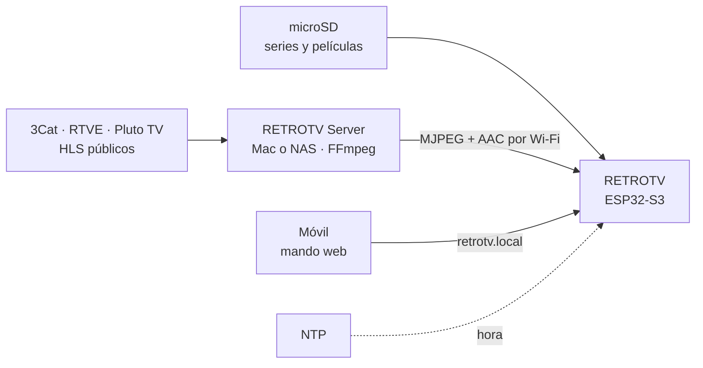
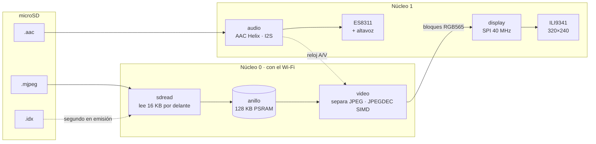
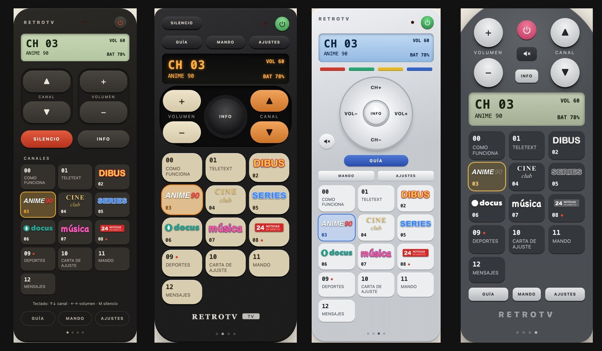
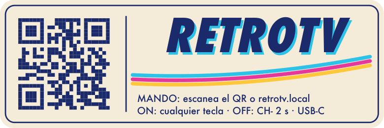
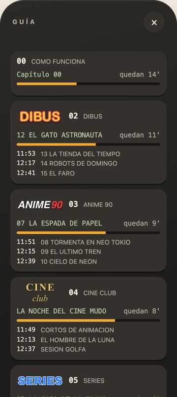
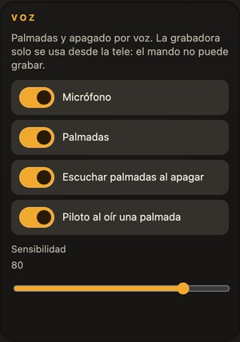

<p align="center">
  
</p>

<h1 align="center">RETROTV</h1>

<p align="center">
  <strong>Una tele de tubo de los 90, en pequeño.</strong><br>
  Enciende, sintoniza y entra en un canal que ya estaba emitiendo.
</p>

<p align="center">
  
  
  
</p>

<p align="center">
  
  <br><sub>El encendido del firmware, fotograma a fotograma.</sub>
</p>

<p align="center">
  <a href="#primeros-pasos">Montarla</a> ·
  <a href="#qué-hace">Qué hace</a> ·
  <a href="#en-15-segundos">En 15 segundos</a> ·
  <a href="#teletexto">Teletexto</a> ·
  <a href="#mando-web">Mando web</a> ·
  <a href="#palmadas-y-mensajes">Palmadas</a> ·
  <a href="#hardware">Hardware</a>
</p>

Enciendes y la pantalla se abre desde la línea del tubo. Suena la estática, aparece un canal y está a mitad de capítulo:
lleva emitiendo desde antes de que llegaras. Cambias de canal y llegan el siseo, el destello y el número en pantalla.
**No parece una lista de archivos. Parece una tele.**

## Un vistazo

<p align="center">
  
  
  <br><sub>Carcasa tele90 v9 · Los cuatro mandos del móvil, capturados de la página real con canales y logos de ejemplo.</sub>
</p>

La carcasa es un diseño propio para impresión 3D. Dentro lleva la [Freenove ESP32-S3 Display 2.8″](#hardware),
una microSD, altavoz y batería. Puedes manejarla con sus botones, con palmadas en el firmware experimental o desde
[el mando web](#mando-web) en la misma Wi-Fi.

> [!NOTE]
> El repositorio no contiene contenido de series o películas. Cada usuario convierte sus propios vídeos y los copia
> a la microSD. Las imágenes de esta página son material del proyecto: renders de la carcasa, la intro, escenas del
> vídeo del canal 0, capturas del mando con canales y logos inventados, y páginas de teletexto dibujadas con el código
> del firmware.

## Qué hace

- 📺 **Canales en emisión.** Cada canal es una programación en bucle anclada a la hora real: al sintonizar entras en el
  capítulo y el segundo que tocan, y si vuelves luego, ha seguido avanzando.
- 🎞️ **Vídeo fluido.** MJPEG 320×240 a 20 fps con sonido AAC sincronizado, calidad JPEG alta y lectura anticipada
  de la SD.
- ⚡ **Zapeo de verdad.** Estática con siseo y destello de tubo entre canales, OSD con número y nombre, carta de
  ajuste, NO SIGNAL y apagado que recoge la imagen en una línea.
- 📟 **Teletexto con la guía real.** Qué echa ahora cada canal, cuánto le queda y qué viene después.
- 📡 **Directos por Wi-Fi.** Un servidor en casa (RETROTV Server) transcodifica directos de 3Cat, RTVE y Pluto TV para
  la tele.
- 📱 **Mando web.** `http://retrotv.local` en el móvil: canales, volumen, lista con logos, guía y ajustes, sin app ni
  nube. Cuatro diseños de mandos de época, que se cambian deslizando el dedo. Un canal enseña un QR para abrirlo.
- 👏 **Palmadas y mensajes (experimental).** Con el firmware `voice`, **tres palmadas** la apagan y otras tres la
  encienden. Una grabadora de mensajes de 15 s y un canal MENSAJES que los pone, todo en la tele y sin Internet
  ([más abajo](#palmadas-y-mensajes)).
- 🔋 **Portátil.** LiPo de 3000 mAh dentro, aviso en pantalla, reposo profundo (también solo, con la batería
  agotada) y encendido con cualquier tecla.

## En 15 segundos

<p align="center">
  
  <br><sub>Escenas del canal 0, el vídeo de bienvenida del proyecto: enchufar, la tele no espera, teletexto y mando por QR.</sub>
</p>

1. **Se enchufa y arranca sola.** La línea del tubo se abre, suena la estática y entra el último canal que veías.
2. **La tele no espera.** Cada canal sigue su horario aunque nadie lo mire: si vuelves en diez minutos, el capítulo
   ha avanzado diez minutos.
3. **El teletexto lo sabe todo.** Qué echa cada canal ahora, cuánto le queda y qué viene después.
4. **El móvil es el mando.** El canal MANDO enseña un QR; se escanea y el móvil manda la tele por la Wi-Fi de casa.

## Índice

- [Cómo funciona](#cómo-funciona)
- [Hardware](#hardware)
- [Primeros pasos](#primeros-pasos)
- [Controles](#controles) · [Mando web](#mando-web) · [Palmadas y mensajes](#palmadas-y-mensajes)
- [Canales](#canales-retrotvconfigchannelsjson) · [En emisión](#en-emisión) · [Teletexto](#teletexto) ·
  [Canales por red](#canales-por-red-retrotv-server)
- [microSD](#microsd) · [Convertir capítulos](#convertir-capítulos) · [Wi-Fi](#wi-fi)
- [Desarrollo](#desarrollo) · [Documentación](#documentación) · [Créditos y licencias](#créditos-y-licencias)

## Cómo funciona



Dentro de la tele, el trabajo se reparte entre los dos núcleos del ESP32-S3. Una pantalla SPI a 40 MHz tarda 38 ms en
dibujar un fotograma, así que el vídeo local va a 20 fps (50 ms por fotograma). Así queda margen para una calidad
JPEG alta.



| | |
|---|---|
| **Pantalla** | ILI9341 de 2,8", 320×240, RGB565 por SPI a 40 MHz (a 80 MHz la imagen sale mal) |
| **Vídeo** | MJPEG 320×240 a 20 fps, `-q:v 3`, a RGB565. Hay *dithering* ordenado 4×4, apagado: en el panel su trama se ve como cuadros en las escenas oscuras |
| **Audio** | AAC-LC mono, 44,1 kHz, 32 kb/s → ES8311 → altavoz de 40×28 mm. El audio marca el reloj |
| **SD** | FAT32 en 4 bits a 40 MHz; una tarea lee el capítulo por delante, porque leer es casi todo esperar a la tarjeta |
| **Medido** | 20 fps estables, sin descartes (con el *dithering* encendido, 0–3 cada 30 s) |

Más detalle en [docs/ARCHITECTURE.md](docs/ARCHITECTURE.md).

## Hardware

- **Placa:** [Freenove ESP32-S3 Display 2.8"](https://github.com/Freenove/Freenove_ESP32_S3_Display), FNK0104A (sin
  táctil) o FNK0104B (táctil). Es un ESP32-S3R8 con 8 MB de PSRAM, 16 MB de flash, pantalla ILI9341, códec ES8311,
  ranura microSD y cargador de LiPo. Pines verificados en [docs/HARDWARE.md](docs/HARDWARE.md).
- **Batería:** LiPo **YUNIQUE 103665**, una celda (1S), 3,7 V nominales y 3000 mAh anunciados, con JST 1.25.
  **Comprueba la polaridad antes de conectar cualquier otra:** pin 1 = BAT+ ([docs/HARDWARE.md](docs/HARDWARE.md#batería)).
- **Carcasa:** tele90 **v9**, la vigente, diseño propio modelado en Blender por script. Según su modelo mide
  92,5 × 85 × 59 mm (sin las patas). Tiene frontal, cuerpo y tapa trasera, que cierran con 12 imanes, sin tornillos,
  y la placa va sujeta sobre pivotes. Por fuera, cuatro teclas con su símbolo grabado, piloto rojo y USB-C directo en
  el lateral. Dentro van el altavoz, bajo la rejilla del techo, y la LiPo, detrás de la placa. Está pensada para PLA o
  PETG con patas de TPU (unas 7 h y ~100 g). **Los archivos de la carcasa no están en este repositorio** y aún no se
  publican como imprimibles. Las carcasas anteriores (v5 y las de 97 y 112 mm de fondo) quedan superadas: sus cotas y
  la posición de su batería no valen para la v9. La **v10** es la v9 en dos piezas; su variante **sin botones** (solo
  LED) se maneja con el mando web y las palmadas y lleva el firmware `voice_nokeys`
  ([docs/HARDWARE.md](docs/HARDWARE.md#integración-física-en-la-carcasa)).

<p align="center">
  
</p>

**Cableado de la carcasa (tele90 v9):**
- Cada tecla empuja un pulsador de 6×6 mm conectado entre su GPIO y GND: CH− **GPIO2**, CH+ **GPIO3**, VOL− **GPIO14**,
  VOL+ **GPIO21**, los cuatro pines del conector de expansión de 1.25 mm.
  - Ese conector no tiene GND: sácalo del conector I2C (3V3, GND, IO15, IO16) o del UART.
  - Los pull-ups son internos; no hacen falta resistencias.
  - GPIO3 es pin de arranque (fuente de JTAG): tenerlo pulsado al encender no afecta a nada que use la tele.
- LED de 3 mm: ánodo al TXD del conector UART (**GPIO43**) con una resistencia de ~1K en serie, cátodo a GND. Parpadea
  un momento al encender (el cargador de arranque escribe por ese pin).
- No mantengas BOOT pulsado al enchufar la placa: entraría en modo descarga.

## Primeros pasos

1. **Tarjeta.** Formatea una microSD en **FAT32 con esquema MBR**. En la Utilidad de Discos de macOS: "MS-DOS (FAT)"
   con "Registro de arranque principal".
2. **Firmware.** Conecta la placa por USB-C y ejecuta `platformio run --target upload` (el normal). La versión con
   micrófono, palmadas y grabadora es `platformio run -e voice --target upload` ([docs/VOICE.md](docs/VOICE.md)); para
   la carcasa sin botones, `-e voice_nokeys`, que nunca deja la tele en un reposo del que solo despierta una tecla.
3. **Capítulos.** Con la SD en el ordenador:
   `tools/convert_video.sh ~/Videos/MiSerie /retrotv/media/channel01 /Volumes/RETROTV`.
   Opcional: `tools/make_demo_clip.sh /Volumes/RETROTV` para el clip de demo.
4. **Canales.** Arranca una vez con la SD puesta para que se cree `/retrotv/config/channels.json` y edítalo a tu gusto
   (ver [Canales](#canales-retrotvconfigchannelsjson)). También puedes copiar
   [data/example-config/channels.json](data/example-config/channels.json).
5. **Wi-Fi (opcional).** Crea `/retrotv/config/wifi.json`, con una o varias redes. Da la hora y los canales remotos; la
   tele funciona sin él.
6. Mete la SD en la placa y enchúfala.

**Requisitos:**
- [PlatformIO Core](https://platformio.org/) 6.x. La primera compilación descarga espressif32@6.9.0 (Arduino core
  2.0.17).
- Cable USB-C de datos. La placa usa el USB nativo del ESP32-S3, así que no necesita driver de puente serie.
- `ffmpeg` para convertir vídeo (`brew install ffmpeg`) y `python3` para los índices.

```sh
platformio run                    # compilar
platformio run --target upload    # flashear por USB-C
platformio device monitor         # log serie (115200)
tools/run_host_tests.sh           # tests en el ordenador
```

Si la subida falla porque el puerto no aparece: mantén BOOT, pulsa RESET, suelta BOOT y vuelve a lanzar el upload.
Si dice `No serial data received`, basta con repetirlo.

## Controles

Los eventos son los mismos venga de donde venga la orden. El táctil solo se activa si al arrancar responde en 0x38
(FNK0104B).

Las cuatro teclas de la carcasa, de izquierda a derecha (actúan al soltar, sin esperas). **Estado:** su lógica está
probada en el ordenador (T19.1), pero **todavía no con los pulsadores montados en la placa** (T19.2, T22.3). En la
placa se han probado BOOT, el mando web y el puerto serie, que dan las mismas órdenes.

| Tecla | Pulsar | Mantener 1 s |
|---|---|---|
| CH− (GPIO2) | Canal anterior | **Apagar** (mantener 2 s) |
| CH+ (GPIO3) | Canal siguiente | Ajustes |
| VOL− (GPIO14) | Volumen − | Silencio |
| VOL+ (GPIO21) | Volumen + | Volumen + |

Con la placa suelta, BOOT: clic = canal siguiente, doble clic = anterior, mantener = ajustes (probado en la placa).

| Táctil | Toque | ← | → | ↑ | ↓ | Mantener 0.8 s |
|---|---|---|---|---|---|---|
| Evento | OSD fijo sí/no | Canal anterior | Canal siguiente | Volumen + | Volumen − | Ajustes |

- **Encender y apagar** (con batería): mantener **CH− 2 s** (o ⏻ en el mando web) apaga la tele: la imagen se recoge
  en la línea del CRT, se apagan pantalla, sonido, Wi-Fi y LED, y el chip se duerme. **Cualquier tecla** (o BOOT) la
  vuelve a encender: arranque normal, con la intro y el último canal. Dormida no tiene Wi-Fi: el mando web no la
  enciende. La tecla con la que se enciende no cuenta como orden. Probado en la placa con el mando web, el puerto
  serie y BOOT; con las teclas montadas, pendiente.
- **Batería:** la barra del canal enseña una pila con el porcentaje junto a la Wi-Fi, y el mando web `BAT 78%`. Al
  bajar del 15 % sale "BATERIA / QUEDA POCA CARGA" y al 5 % "CONECTA EL USB-C" (una vez por nivel). Se carga por el
  USB-C de la placa (TP4054, ~300 mA nominales: unas 10–11 h estimadas de vacía a llena); enchufada, la tele funciona
  del cable y la batería solo carga. Sin batería conectada la lectura es la salida del cargador y enseña ~90 %. El
  porcentaje sale de una curva genérica de LiPo, no de una descarga medida de esta celda.
- **Cargando:** al enchufar el USB-C sale "CARGANDO / BATERIA 78%" y, mientras carga, la pila de la barra se ve verde
  con un rayo amarillo; el mando web pone `CARGANDO 78% ⚡`. La placa no tiene ningún pin que diga si hay cable: la tele
  lo deduce del salto de ~100 mV que da la lectura al enchufar o desenchufar y, si se encendió ya enchufada, de que la
  tensión suba durante unos minutos. Mientras carga, el porcentaje marca algo de más (es la tensión de carga).
- **Medido** (2026-10-02, por el USB del Mac y con la tele encendida): del 81 % al 99 % en unas 2 h 45 min. La última
  hora la tensión apenas sube (el cargador mantiene la tensión y baja la corriente) y se queda en ~4,19 V leídos: ahí ya
  está llena. Si la tele se reinicia enchufada con la batería casi llena, puede no marcar CARGANDO, porque la tensión ya
  no sube.
- **Autonomía (estimada, sin medidor):** viendo la tele, unas 8–10 h suponiendo ~0,3 A, sin medir todavía
  (`tools/battery_log.py` registra una descarga completa). En STANDBY VOZ, unos 40 mA (30–50), deducidos de una noche
  en standby: unos 3 días desde llena.
- **Batería agotada:** si se queda en el 2 % (~3,42 V) durante unos 30 s, sale "BATERIA / AGOTADA: SE APAGA" y la
  tele pasa a reposo, para no vaciar la celda. Al encenderla con la batería aún agotada se vuelve a apagar; con el
  USB-C enchufado, no.
- **Conector:** JST 1.25 de 2 pines, pin 1 = BAT+ y pin 2 = GND. Comprueba la polaridad de la batería antes de
  enchufarla: en las baratas el rojo y el negro a veces vienen al revés.
- **LED del frontal** (GPIO43): encendido mientras la tele funciona; se apaga un instante con cada orden (teclas,
  mando web, táctil), como el piloto de una tele de los 90. Pendiente de probar entero con el LED montado (T19.3).
- **Teletexto:** en ese canal no hay sonido, así que VOLUMEN + / − (o un toque) pasa de página.
- **Ajustes:** CH−/CH+ mueven la selección, VOL+ elige o sube, VOL− baja, y mantener CH+ sale. Las opciones son WI-FI
  (estado y reintentar), BRILLO (10–100 %), VOLUMEN, DIAGNOSTICO y REINICIAR; con el firmware `voice`, también VOZ
  (micrófono, palmadas, sensibilidad, APAGADO, LED ESCUCHA y GRABAR MENSAJE).

## Mando web

<p align="center">
  
  <br><sub>De izquierda a derecha: CLÁSICO, NEGRO, PLATA y GRIS, con canales y logos inventados. Los tres primeros enseñan
  los logos en color; el GRIS, en una sola tinta.</sub>
</p>



Con la tele en la Wi-Fi, abre **http://retrotv.local** en el móvil, conectado a la misma red. Si el móvil no resuelve
`.local`, usa la IP que sale en el log (`[WEB] remote at …`).

- **Qué hace:** CANAL ▲▼, VOLUMEN + −, SILENCIO, INFO (el OSD) y la lista de canales para saltar directamente a
  uno. La pantalla de arriba muestra el canal y el volumen actuales. Los canales remotos llevan un punto rojo.
- **Cómo funciona:** las órdenes entran por el mismo camino que los mandos físicos. Un salto directo pasa por la
  estática y el destello, como un zapeo.
- **Dónde vive:** la página la sirve la propia tele, sin nube y sin el Mac. Pesa unos 42 KB y funciona sin Internet.
- **Cuatro mandos (botón MANDO, o deslizando el dedo a un lado):** cada uno con la forma, los colores y la colocación
  de un mando de verdad:
  - CLÁSICO, el de siempre;
  - NEGRO, de televisor de los 90: teclas beige, canal en naranja, pantalla fluorescente y un panel hundido con
    volumen, un INFO redondo como un joystick y canal, encima de los canales; logos en color;
  - PLATA, de los 2000: plateado cepillado, teclas de colores, un gran aro que hace de cruceta (CH+ arriba, CH−
    abajo, VOL− y VOL+ a los lados, INFO en medio) y GUÍA en la píldora azul del MENU; logos en color;
  - GRIS, europeo de cabeza redonda: la cabeza, más ancha que el cuerpo, lleva volumen, canal, encendido y silencio;
    logos en blanco, de una sola tinta.
  Cada móvil recuerda el suyo, y `http://retrotv.local/?skin=negro` (o `plata`, `gris`) abre uno directamente.


- **Guía (botón GUÍA, o `http://retrotv.local/#guia`):** cada canal con su logo, lo que echa ahora con su barra y los
  minutos que quedan, y los tres siguientes con su hora; tocar uno lo sintoniza. Es la misma programación que el
  teletexto. La tele solo la prepara mientras alguien la mira: lee la de cada canal en segundo plano (unos 25 s la
  primera vez) sin frenar el vídeo ni el mando.
- **Seguridad:** no tiene PIN; cualquiera en la misma Wi-Fi puede cambiar de canal. Las órdenes exigen la cabecera
  `X-RETROTV`, así que otra web abierta en el móvil no puede mandarlas.

**Logos de los canales:** `/retrotv/logos/<id del canal>.png` en la SD (el `id` de `channels.json`).
- **Formato:** PNG de 360×160 px con fondo transparente, hasta 32 KB cada uno. Se ven a una cuarta parte, nítidos en
  pantallas retina. `tools/make_logo.py <archivo|url> <id> <carpeta>` los prepara: recorta, iguala el peso visual
  (una palabra fina ocupa más que un bloque macizo) y aclara los logos negros, que no se verían sobre las teclas oscuras.
  Para un logo blanco impreso sobre una caja negra, el modo `mono` deja solo las letras.
- **Tres versiones:** `<id>.png` en color (CLÁSICO, NEGRO y PLATA), `<id>.black.png` en negro (sin uso por ahora) y `<id>.white.png` en
  blanco. Un logo plano sale en silueta; uno con letras perfiladas, en tonos de una sola tinta (`--black` y `--white`
  eligen `solid` o `tonal`). Si falta una versión, la tele sirve la de color.
- **Carga:** la tele los lee a PSRAM al arrancar, así que nunca compiten con el vídeo por la SD. El móvil los guarda
  un día. Sin logo, el canal enseña su nombre.
- **Derechos:** los logos son marcas de sus dueños. Van solo en tu SD, **nunca en el repo**, igual que los capítulos.

**Ajustes** (botón AJUSTES al final del mando, o directamente `http://retrotv.local/#ajustes`):
- **Emparejar:** pulsa MOSTRAR CÓDIGO; la tele enseña un código de 4 cifras durante 60 s. Escríbelo en el móvil, que
  queda autorizado mientras lo uses (caduca a los 30 min sin usarlo). Con 5 códigos mal hay que pedir otro. Solo quien
  ve la tele puede tocar los ajustes.
- **Wi-Fi:** las redes guardadas (sin contraseña), BUSCAR REDES para las de 2,4 GHz al alcance y AÑADIR RED, que la
  guarda en `wifi.json` de la SD. Las redes de `secrets.h` van en el firmware y no se pueden borrar desde aquí.
- **Pantalla y sonido:** brillo y volumen, guardados como con los mandos.
- **Voz** (solo con el firmware `voice`): micrófono, palmadas, sensibilidad, escuchar palmadas al apagar (STANDBY VOZ)
  y el destello del piloto al oír una palmada; los mismos ajustes que AJUSTES → VOZ en la tele. La grabadora no está
  aquí a propósito: el mando no tiene PIN y cualquiera en la Wi-Fi podría grabar la sala
  ([ver más abajo](#palmadas-y-mensajes)).
- **Canales:** activa o desactiva cada canal. Se guarda en `channels.json` de la SD; el zapeo y el mando se saltan los
  desactivados.
- **Información:** versión, Wi-Fi, IP, SD, memoria y REINICIAR LA TELE.
- **Cómo se guarda:** la tele escribe `wifi.json` y `channels.json` en una copia `.tmp` y la pone en su sitio al
  acabar. Un corte de luz nunca deja un archivo a medias.

**Canal del mando:** un canal `internal` con `"source": "mando"` enseña un QR grande con la dirección de la tele
(`http://<ip>/`) y la dirección escrita debajo. Se escanea con la cámara del móvil y abre el mando.
- **Por qué la IP y no `retrotv.local`:** algunos Android no resuelven nombres `.local`. En iPhone, Safari sí; Chrome
  solo con el permiso de red local (Ajustes → Privacidad y seguridad → Red local).
- **Lista de canales:** con la página abierta se actualiza sola cuando cambia (tele reiniciada con otra
  `channels.json`, un canal activado o desactivado): `/api/state` lleva `list`, que cambia con ella.
- **Cambios de red:** si la IP cambia, el QR se redibuja solo. Sin Wi-Fi enseña `SIN WI-FI`.
- **Pegatina:** `tools/make_remote_sticker.py <carpeta>` hace una pegatina de 36 × 46 mm con el QR de
  `http://retrotv.local` (PDF suelto y hoja A4 de 20). Imprime al 100 %.

<details>
<summary><b>API HTTP de la tele</b></summary>

- `GET /api/state`: canal, nombre, volumen, silencio, pantalla, batería (`battery` en %, `battery_mv`, `charging`) y `list`;
- `GET /api/channels`: la lista de canales activos (`logo: true` si tiene logo);
- `GET /api/logo?n=<número>[&c=black|white]`: el PNG del logo, en color o en una tinta (si no hay esa versión, en color);
- `GET /api/guide`: la guía (`{"pending":true}` mientras se prepara; horas en segundos del reloj de la tele);
- `POST /api/key?k=next|prev|volup|voldown|mute|info`;
- `POST /api/channel?n=<número>`.

Los `POST` necesitan la cabecera `X-RETROTV: 1`. Los ajustes van en `/api/config/…`:
- se empareja con `POST /api/config/pair/start` y `POST /api/config/pair {"code"}`, que devuelve un `token`;
- el resto necesita la cabecera `X-RETROTV-Token`: `info`, `wifi`, `display`, `channels`, `voice` (`GET`, y `POST`
  con `{"mic", "claps", "sensitivity", "standby": "voice"|"deep", "led"}`; sin voz responde `{"available": false}`)
  y `reboot`.

</details>

## Palmadas y mensajes

Con el firmware `voice` (`platformio run -e voice --target upload`; en la carcasa sin botones, `-e voice_nokeys`) la
tele usa su micrófono. Todo pasa dentro de la tele: sin Internet y sin servicios de reconocimiento.



- **Apagar y encender con tres palmadas.** Con un canal puesto, tres palmadas seguidas (plas-plas-plas, a menos de
  0,7 s entre ellas) la apagan con el efecto del tubo y la dejan en STANDBY VOZ, escuchando. Tras un momento de
  silencio, otras tres la encienden. El piloto destella con cada palmada que oye. Dos palmadas no hacen nada: es lo
  que más se cuela.
- **No es infalible.** Funciona con palmadas firmes a 0,5–1 m. Algún ruido de casa puede colarse, y una palmada floja
  que coincide con un golpe del programa no cuenta. La sensibilidad (80 por defecto) se cambia en AJUSTES → VOZ, en la
  tele o en el mando.
- **Consumo.** STANDBY VOZ gasta unos 40 mA (estimado de una noche, sin medidor): unos 3 días desde llena. Con la
  batería agotada, duerme del todo.
- **Mensajes.** AJUSTES → VOZ → GRABAR MENSAJE: cuenta atrás, ● REC hasta 15 s, y se guarda como WAV en la microSD,
  subido al nivel de la voz para que se oiga bien. El canal **MENSAJES** se añade solo a la lista y los pone en bucle.
- **Privacidad.** Las palmadas no graban nada: solo miden niveles. La grabadora solo graba cuando la pones en marcha
  desde la tele, con ● REC en pantalla; el mando web no puede grabar.
- **Lo que no hay:** ni "HEY RETRO" ni comandos de voz.

Detalle, medidas y pruebas: [docs/VOICE.md](docs/VOICE.md).
<br clear="right">

## Canales (`/retrotv/config/channels.json`)

```json
{ "channels": [
  { "id": "bola", "number": 2, "name": "Bola de Drac", "type": "local",
    "source": "/retrotv/media/channel01", "enabled": true },
  { "id": "carta", "number": 9, "name": "Carta de ajuste", "type": "internal",
    "source": "testcard" }
] }
```

| Campo | Obligatorio | Notas |
|---|---|---|
| `id` | sí | texto, hasta 23 caracteres |
| `number` | sí | 0–999, sin repetir; el zapeo sigue este orden y se salta los huecos (el 0 va antes del 1: sirve para un tutorial) |
| `name` | sí | se muestra en el OSD en mayúsculas y sin acentos (la fuente de 8 bits no los tiene: "Bola de Drac" → `BOLA DE DRAC`) |
| `type` | sí | `local`, `internal`, `remote` (por red, desde RETROTV Server); `hls-proxy`, `tunarr` y `stream` se reconocen pero muestran NO SIGNAL "V0.2" |
| `source` | sí | `local`: un `.mjpeg` o una **carpeta**: con índices, sus capítulos en orden de nombre y **en emisión**; sin ellos, un capítulo al azar desde el principio. `internal`: `testcard` (carta de ajuste), `teletext` o `mando` (un QR para abrir el mando web). `remote`: `http://<servidor>:8080/channel/<n>` |
| `enabled` | no | `true` por defecto; los desactivados se saltan al hacer zapeo |

- **Entradas inválidas:** se ignoran y el log dice cuál y por qué (`[CHANNEL] 2 entries skipped, first: #3: unknown type`).
- **Sin ningún canal válido, o sin SD:** error en pantalla durante 5 s y la tele sigue con la carta de ajuste.
- **Si un canal falla** (carpeta vacía, archivo roto): NO SIGNAL durante 3 s y pasa solo al siguiente.
- **Memoria:** el último canal y el volumen se recuerdan tras apagar.

**Un canal 0 de bienvenida.** El 0 va antes del 1, así que sirve para un vídeo que explique la tele, en bucle como
cualquier otro canal. El de este proyecto es propio y no viene en el repositorio:

<p align="center">
  
</p>

## En emisión

Cada canal local es una programación en bucle: sus capítulos **en orden de emisión**, uno detrás de otro.
- El orden es el del nombre, pero **natural**: los separadores no cuentan y los números se comparan como números.
- Así, aunque una serie mezcle estilos (`Harlock -01- …` y `Harlock_02_…`, o `Hattori -008-` y `Hattori_010_…`),
  cada capítulo sale en su sitio.

- **Al sintonizar**, la tele calcula dónde va la emisión: `hora UTC mod duración total`. Entra en ese capítulo y en
  ese segundo, igual que una tele de verdad. Si vuelves al canal un rato después, ha seguido avanzando.
- **Al acabar un capítulo** empieza el siguiente desde el principio.
- **Sin hora** (sin Wi-Fi, o antes de que llegue el NTP) usa un reloj de sesión: un origen al azar en cada arranque
  más el tiempo encendida. Los canales siguen siendo continuos mientras la tele está encendida.

Para saltar a un segundo concreto hace falta un `<nombre>.idx` junto a cada capítulo:
- **Qué contiene:** dónde empieza cada segundo en el `.mjpeg` y en el `.aac`, y los fps del capítulo (sin `.idx` se
  reproduce a 24). Unos 11 KB por capítulo de 23 min.
- **Cómo se genera:** `convert_video.sh` lo hace solo al convertir. Para lo convertido antes, o si falta:

```sh
tools/make_index.py /Volumes/RETROTV/retrotv/media   # recorre la SD; solo (re)indexa lo que falta o ha cambiado;
                                                    # sin --fps conserva los del .idx que había (si no, 24)
```

- **Si falta algún índice en un canal,** ese canal funciona como antes (capítulo al azar desde el principio) y el log
  dice cuál falta.
- **Si un índice no coincide** con su capítulo (reconvertido sin reindexar), la tele lo detecta y empieza desde el
  principio.

## Teletexto

Un canal `internal` con `"source": "teletext"` es un teletexto con la **guía de programación real**. Como cada canal
emite según la hora y las duraciones de sus `.idx`, la tele sabe qué echa cada uno ahora y qué viene después. Los
canales en directo salen de la guía del servidor.

| Página | Qué muestra |
|---|---|
| **P100** Inici | Portada: fecha, índice y cómo pasar de página |
| **P101** Ara en emissió | Todos los canales: el capítulo de ahora y los minutos que le quedan (5 por subpágina: 1/3, 2/3…) |
| **P2NN** | La guía del canal NN (P203 = canal 3): el capítulo de ahora con una barra de progreso y los 4 siguientes con su hora |

<p align="center">
  
  <br><sub>P100 → P101 → P202 → P203, con canales inventados. Dibujado con la fuente, los colores y el repintado de arriba
  abajo del firmware (<code>Teletext.h</code> y <code>UITeletext.cpp</code>), a 320×240 y ampliado al doble.</sub>
</p>

- **Pasar de página:** solas cada 12 s, en orden. VOLUMEN +/− (o un toque) pasa a mano; la página elegida se queda 60 s.
- **Estilo:** rejilla de 26×15 caracteres con los 8 colores del teletexto y títulos a doble altura. Es mudo.
- **Títulos:** salen del nombre del archivo. El primer número es el capítulo y las palabras siguientes el título, hasta
  la primera etiqueta de ripeo (`per`, `by`, `dvdrip`…). Lista en `src/teletext/Teletext.h` (`isRipTag`); los
  nombres propios de tu colección (quién lo subió, de qué web) van en `include/title_tags.h`, que no se sube al repo.
- **Sin hora** (sin Wi-Fi): las horas de inicio salen como minutos desde ahora (`+12'`).
- **Al entrar**, lee la cabecera `.idx` de los canales que aún no se habían sintonizado, uno por vuelta del bucle.
  Mientras tanto, esos canales dicen `CERCANT...`.

## Canales por red (RETROTV Server)

Un canal `remote` llega por Wi-Fi desde **RETROTV Server**, un servidor en el ordenador de casa o en un NAS
(`server/`, Python + FastAPI, también en Docker). La tele no sabe qué hay detrás: para ella es una URL, y el servidor le
da vídeo y audio en su formato, que reproduce el mismo `MediaPlayer` que lee de la SD.
- **Qué emite el servidor:** archivos ya convertidos y **directos**: un HLS público cualquiera, canales de **3Cat**
  desde su API oficial, el Canal 24 Horas de **RTVE** (lo que RTVE da sin DRM ni registro) y canales de **Pluto TV**.
- **Cómo:** FFmpeg transcodifica en el ordenador. La tele nunca ve HLS.
- **Fuentes, límites y decisiones** (por ejemplo, el cifrado de Pluto TV): [docs/PROVIDERS.md](docs/PROVIDERS.md).
  Instrucciones del servidor, también para QNAP: [server/README.md](server/README.md).

```sh
server/run.sh --lan    # en el ordenador: 0.0.0.0:8080, anuncia retrotv-server.local, canal 1 = REMOTE DEMO
```

En `channels.json` de la SD:

```json
{ "id": "remote_demo", "number": 20, "name": "Remote Demo", "type": "remote",
  "source": "http://retrotv-server.local:8080/channel/1", "enabled": true },
{ "id": "sx3", "number": 21, "name": "SX3", "type": "remote",
  "source": "http://retrotv-server.local:8080/channel/10", "enabled": true }
```

El número tras `/channel/` es el del canal **en el servidor** (`server/config/channels.json`): en el ejemplo, 1 es
el demo, 2 HLS TEST y 10 SX3. El número de la tele (`number`) lo eliges tú.

- **Al sintonizar**, la tele pide una sesión al servidor. El servidor fija el instante del canal (también **en
  emisión**) y la tele abre vídeo y audio desde ese mismo instante.
- **Mientras conecta** sigue la estática con su siseo. En cuanto tiene ~1,3 s de vídeo en el búfer, destello y
  empieza la imagen: en un archivo 1–2 s y en un directo 2–8 s, porque primero arranca FFmpeg.
- **Si algo falla**, NO SIGNAL con el motivo:

  | Motivo | Qué pasa |
  |---|---|
  | `OFFLINE` | La tele no tiene Wi-Fi. Los canales de la SD siguen igual |
  | `NO SERVER` | El servidor no responde o `retrotv-server.local` no resuelve (pon la IP) |
  | `NO CHANNEL` | Ese número no existe en el servidor |
  | `CHANNEL OFF` | Existe, pero el servidor no lo puede emitir ahora |
  | `SIGNAL LOST` | Se cortó a mitad: el servidor se paró o la red dejó de llegar 3 s |

  - **Reintentos:** la tele vuelve a probar a los 2, 4 y 8 s, y después cada 15 s mientras sigas en el canal. Cuando
    el servidor vuelve, la imagen vuelve sola.
  - **Nunca se queda bloqueada:** puedes cambiar de canal en cualquier momento.
- **macOS:** la primera vez, el firewall pregunta si Python puede aceptar conexiones entrantes. Hay que decir que sí;
  si no, la tele muestra `NO SERVER`.
- **Volver a modo local:** basta con cambiar de canal. Sin servidor ni Wi-Fi, los canales de la SD funcionan como
  siempre.

## microSD

- **Formato:** FAT32 con esquema MBR. El core 2.0.17 **no lee exFAT**, que es como vienen de fábrica las tarjetas
  de más de 32 GB. Comprueba las tarjetas nuevas con `f3write`/`f3read`: una de 32 GB, probablemente falsa, perdió su
  sistema de archivos.
- **Cómo se monta:** en 4 bits a 40 MHz y, si falla, a 20 MHz. El firmware nunca formatea la tarjeta. Si deja de
  responder (pasa a veces mientras la Wi-Fi busca redes), la tele la vuelve a montar sola y sigue.
- **Espacio:** ~370 MB por capítulo de 23 min: en 64 GB caben unos 160.
- **Estructura:** se crea al arrancar si falta:

```
/retrotv/config/channels.json   canales
/retrotv/config/wifi.json       Wi-Fi (opcional)
/retrotv/media/channel01/       capítulos de una serie (.mjpeg + .aac + .idx con el mismo nombre)
/retrotv/media/channel02/
/retrotv/media/demo/            clip de demostración
/retrotv/logos/<id>.png         logos de los canales para el mando web (opcional), más <id>.black.png y <id>.white.png
/retrotv/system/intro.mjpeg (+ .aac) vídeo al encender, opcional (convert_video.sh <carpeta> /retrotv/system;
                    con RECORTE_4_3=1 si es 4:3 dentro de 16:9). Tras él, la transición de canal
/retrotv/sounds/                    reservada para versiones futuras
```

Los archivos ocultos que crea macOS (`._*`, `.Spotlight-V100`…) se ignoran.

## Convertir capítulos

Requiere `ffmpeg` y la SD montada en el ordenador.

```sh
tools/convert_video.sh ~/Videos/MiSerie /retrotv/media/channel01 /Volumes/RETROTV
PISTA=1 tools/convert_video.sh ...        # 2.ª pista de audio (doblajes); por defecto la 0
CALIDAD=5 FPS=20 tools/convert_video.sh ...  # calidad JPEG (2 mejor – 31) y fps (1–24); por defecto 3 y 20
RECORTE_4_3=1 tools/convert_video.sh ...  # imagen 4:3 dentro de un 16:9: llena la pantalla sin bandas
SOLO_VIDEO=1 tools/convert_video.sh ...   # rehace solo la imagen de lo ya convertido; conserva el .aac
FILTROS="deblock=filter=strong:block=8,hqdn3d=2:1.5:3:3,eq=gamma=1.12:saturation=1.15" tools/convert_video.sh ...
                                          # filtros de ffmpeg antes de reducir, por serie: este quita bloques
                                          # y ruido de una fuente MPEG-4 y la aclara un poco (Evangelion)
tools/make_demo_clip.sh /Volumes/RETROTV  # clip de demo original: destello + pitido cada segundo (sincronía)
```

| | Formato |
|---|---|
| Entradas | mp4, mkv, avi, mov, m4v, webm (también enlaces simbólicos) |
| Vídeo | `<nombre>.mjpeg`: MJPEG crudo, 320×240, 20 fps (`FPS`), yuvj420p, `-q:v 3` (`CALIDAD`). 4:3 llena la pantalla; 16:9 queda 320×176 con bandas negras (cortada a bloques JPEG enteros de 16 píxeles, para que el ruido del JPEG no manche las bandas); los anamórficos se corrigen. Nunca se deforma |
| Audio | `<nombre>.aac`: AAC-LC en ADTS, mono, 44.1 kHz, 32 kb/s, loudnorm a −16 LUFS (pico −1.5 dBTP) para el altavoz pequeño |
| Índice | `<nombre>.idx`: segundos y fps, para entrar en emisión ([En emisión](#en-emisión)) |
| Nombres | ASCII sin acentos, en minúsculas, seguros en FAT |
| Tamaño | ~370 MB por capítulo de 23 min (q3 a 20 fps: 13 KB por fotograma de media) |
| Velocidad | ~30 s por capítulo en un Mac con Apple Silicon |

**Por qué q3 y 20 fps** (medido en la placa, 2026-10-01): a 24 fps dibujar un fotograma ocupa 38 de sus 41,7 ms y se
pierden fotogramas. A 20 fps, q3, q4 y q5 van igual de fluidos y q3 se ve mejor: +3 dB de PSNR frente a q5 por un
tercio más de espacio.

- Lo ya convertido se salta.
- Todo se escribe como `.part` y se renombra al final: un corte no deja capítulos rotos.
- Primero se convierte el audio, así que una `PISTA` que no existe falla al momento.
- Al terminar, `dot_clean -m /Volumes/RETROTV` borra los `._*` de macOS. El firmware los ignora igualmente.

## Wi-Fi

La tele funciona siempre desde la SD. El Wi-Fi aporta la hora (NTP), los canales remotos y el mando web. El ESP32-S3
solo usa **2.4 GHz**.

- **Primer intento:** dura como mucho 8 s, en paralelo con las pantallas de arranque. Si no conecta, la tele entra
  en LOCAL MODE al momento y reintenta en segundo plano cada 60 s.
- **Varias redes:** la tele recuerda hasta 8 y se une sola a la que tenga a su alcance (casa, oficina…).
  - **Cómo elige:** con más de una red, cada intento empieza con un escaneo en segundo plano (~2 s). Prueba primero
    las redes conocidas que ve, de la más fuerte a la más débil. Después prueba las que no ve, por si alguna tiene
    el SSID oculto.
  - **Si no encuentra ninguna:** el log lista las redes de 2.4 GHz que sí ve (`[WIFI]   visible: …`). Sirve para
    saber si la oficina emite en 2.4 GHz y con qué nombre.
- **Dónde se guardan:** se juntan las dos fuentes; si un SSID se repite, gana `wifi.json`.
  1. `/retrotv/config/wifi.json` en la SD: `{"networks": [{"ssid": "...", "password": "..."}, ...]}`. Una sola red
     también vale en el formato de antes, `{"ssid": "...", "password": "..."}`. Ejemplo en
     [wifi.example.json](data/example-config/wifi.example.json). También se añaden desde los ajustes del mando web.
  2. `include/secrets.h` para desarrollo: se copia de `include/secrets.example.h` y git lo ignora. Admite una red
     (`PAUTV_WIFI_SSID` / `PAUTV_WIFI_PASSWORD`) y más con `PAUTV_WIFI_NETWORKS`.

> [!WARNING]
> La contraseña queda en **texto plano** en ambos casos: en la SD, legible por cualquiera que la meta en un
> ordenador, y dentro del firmware si se usa `secrets.h`. Usa una red de invitados si eso te preocupa.

**Ajustes guardados:** el volumen, el último canal y el brillo se guardan en NVS (flash interna) cuando llevan 4 s sin
cambiar, para no desgastar la flash con el zapeo. Al reiniciar se recuperan.

## Desarrollo

<details>
<summary><b>Depuración por el puerto serie</b></summary>

Con `PAUTV_DEBUG_STATS 1` (en `config.h`), cada 5 s durante la reproducción se imprimen fps, ms de decodificación y
de dibujo, `av_drift_ms`, `dropped_frames`, desbordamientos, KB/s de la SD, heap, PSRAM y las marcas de vida de las
tareas. Abrir el puerto reinicia la placa. Además acepta estos comandos por el monitor serie:

- `n` / `p`: canal siguiente / anterior. `+` / `-`: volumen. `x`: silencio. `o`: OSD fijo. `M`: menú. `q`: apagar
  (= mantener CH−). Hacen lo mismo que los mandos.
- Con el firmware `voice`: `v` (niveles del micrófono), `V` (pausa la captura), `R` (grabar), `Y` (mensaje de
  prueba), `E` (borrar los mensajes) y `W` (encender desde STANDBY VOZ). Detalle en [docs/VOICE.md](docs/VOICE.md).
- `F`: el apagado que provoca una batería agotada (para probar el despertar cada 5 min de la versión sin botones).
- `d`: *dithering* sí/no, para compararlo (sale en pantalla "DITHER ON/OFF"). Por defecto, apagado.
- `w`: enseña el aviso de batería, para verlo sin gastarla.
- `m`: foto de la memoria (heap, mínimo, bloque más grande, PSRAM).
- `z`: 100 cambios de canal automáticos, uno cada 1.5 s (prueba rápida de estabilidad).
- `S<segundos>` + Enter: **soak test**.
  - Cambia de canal cada N segundos; `S0` no cambia nunca, útil para medir un solo canal durante horas.
  - Cada minuto escribe una línea `[SOAK]` con memoria (actual, mínima, bloque más grande, PSRAM frente al inicio),
    `dropped_frames`, `av_drift_ms`, errores de audio y marcas de vida de las tareas (`STALLED` si alguna se para).
  - `s` lo detiene.
- `T <ruta>` + Enter: sintoniza cualquier carpeta o `.mjpeg` como canal temporal (pruebas); cualquier zapeo vuelve
  a `channels.json`. Con `T http://<servidor>:8080/channel/<n>` sintoniza un canal remoto sin tocar la SD.
- `D <s> <carpeta> [url de bench] [scan]` + Enter: lee un capítulo de la SD durante s segundos como lo hace la
  reproducción y da los KB/s; opcionalmente con la Wi-Fi recibiendo o buscando redes a la vez.
- `B <n> <url>` + Enter: caudal TCP bruto durante 10 s con n conexiones (1–4) a `/api/bench` de un RETROTV Server
  (`B 1 http://192.168.1.x:8080/api/bench`). Para la reproducción mientras mide.
- `g<página>` + Enter: en el canal de teletexto, va a esa página (`g101`, `g203`). Cada página nueva se escribe
  también en el log como texto, fila a fila.
- Mientras suena un canal remoto, una línea `[NET]`. Sale cada segundo los primeros 30 s tras sintonizar y
  después cada 5 s. Campos:
  - `network_kbps`: caudal;
  - `buffer_bytes` y `buffer_fill`: búfer de vídeo y audio;
  - `read_stalls` y `wait_ms`: veces que el reproductor encontró el búfer vacío y cuánto esperó;
  - `timeouts` y `reconnects`;
  - `rssi`;
  - `dropped_frames`, `fps` y `av_drift_ms` (media y máximo);
  - `link`: la tarea de red encontró datos, nada o el anillo lleno;
  - `gap_max_ms`: la espera más larga por un byte de vídeo.

  Al sintonizar, `[TUNE] time_to_first_video_ms` y `time_to_stable_playback_ms` (5 s seguidos sin descartes ni
  esperas). Al conectar la Wi-Fi, `[WIFI] +Ns rssi` cada segundo durante 30 s. Las líneas `[SERVER]` y `[REMOTE]`
  cuentan cada sesión, conexión y reintento. Qué significan y qué se midió con ellas:
  [docs/NETWORK_TUNING.md](docs/NETWORK_TUNING.md).

Nada de esto se activa solo, y con `PAUTV_DEBUG_STATS 0` ni siquiera se compila.

</details>

<details>
<summary><b>Pruebas en la placa</b></summary>

```sh
tools/make_test_fixtures.sh /Volumes/RETROTV   # clips sintéticos en /retrotv/test (8 MB)
tools/device_tests.py                        # con la SD en la placa y el USB conectado
```

El script reinicia la placa y comprueba en el log, sin tocar nada:
- la transición entre capítulos indexados;
- que detecta un `.idx` que no coincide;
- el canal sin índices;
- el EOF limpio con audio más corto o más largo que el vídeo;
- que un archivo vacío no provoca un bucle;
- que el zapeo vuelve a los canales normales.

Además, que no hay reinicios, watchdog ni tareas atascadas.

Canales remotos, con la placa en el mismo Wi-Fi que el ordenador:

```sh
tools/remote_device_tests.py   # arranca su propio RETROTV Server, lo para y lo vuelve a arrancar
```

Con `--live` prueba un directo HLS: monta su propia fuente para pararla y volver a arrancarla, y hace 20 zapeos entre
el directo y la SD. Comprueba:
- que el canal remoto se ve (fps, desfase A/V, kbps);
- los cambios remoto → SD, SD → remoto y remoto → remoto, y que el servidor cierra cada sesión;
- que al parar el servidor sale NO SIGNAL con reintentos y que la imagen vuelve sola;
- que el zapeo sigue respondiendo, sin reinicios ni errores de SD.

`tools/stream_profiles.py` compara perfiles de directo (fps, calidad, búfer) midiendo en la placa.

`tools/battery_log.py http://retrotv.local descarga.csv` registra una descarga completa por Wi-Fi (batería llena,
sin USB-C) hasta que la tele se apaga, y da la autonomía y la curva de tensión medida para `src/power/Battery.h`.

</details>

<details>
<summary><b>Tests en el ordenador</b></summary>

```sh
tools/run_host_tests.sh              # clang/gcc del sistema, con ASan y UBSan
SDKROOT=$(xcrun --show-sdk-path) CXX=g++-16 tools/run_host_tests.sh   # GCC de Homebrew en macOS
SANITIZE=0 tools/run_host_tests.sh   # sin sanitizers
```

Son 692 comprobaciones de la lógica pura (clics, gestos, ejes del táctil, volumen y sintetizador, separador MJPEG,
reloj A/V, `channels.json`, nombres ASCII, recorte del OSD, índice `.idx`, posición en emisión, teletexto, anillo de
bytes, protocolo de canales remotos, mando web y ajustes, redes Wi-Fi, batería y voz: niveles, palmadas, standby por
voz y grabadora), compiladas con clang, ASan y UBSan, más los autotests de `make_index.py` y `make_dist.py`. No hace falta la placa.
ArduinoJson se toma de `.pio/libdeps` y, si falta, se descarga con `pio pkg install`.

Nuestro código compila con `-Wall -Wextra -Werror`. ArduinoJson entra con `-isystem`, y los dos falsos positivos que
GCC aún encuentra dentro de la librería (`maybe-uninitialized` y `aggressive-loop-optimizations`, tras el inlining)
se ignoran solo alrededor de ella, en `test/third_party.h`. Probado con clang y GCC 16, con y sin sanitizers.

El servidor tiene sus propios tests (`pytest`, ver [server/README.md](server/README.md)).

</details>

<details>
<summary><b>Paquete del código para compartir</b></summary>

```sh
tools/make_dist.py            # dist/retrotv-<versión>-<commit>.zip con lo que hay en HEAD
```

Sale de `git archive`, así que solo lleva archivos que Git sigue: nunca `include/secrets.h`, `include/title_tags.h`,
`.pio`, entornos virtuales, cachés, `server/media`, la configuración local del servidor ni `.git`. Después revisa el
ZIP por nombres y rutas (vídeo, audio, índices, carcasas, temporales) y comprueba que ningún texto de tu
`include/secrets.h` aparece dentro, sin escribirlo en pantalla. Si algo falla, borra el ZIP y lo dice. Lleva
`include/secrets.example.h` para configurar la Wi-Fi. Los cambios sin commit no entran: haz commit antes.

</details>

<details>
<summary><b>Estructura del código</b></summary>

```
platformio.ini          entornos "pautv" (el normal), "voice" (+ micrófono) y "voice_nokeys" (carcasa sin botones): espressif32@6.9.0, gnu++17, -Wall -Wextra en src/
include/config.h        ajustes de la app: tiempos, rotación, SPI, audio, vídeo, tareas y prioridades, PAUTV_DEBUG_STATS
include/board_config.h  pines verificados (fuentes en docs/HARDWARE.md) y ejes del táctil
include/app_types.h     estados, eventos de entrada, macro de log con prefijo
src/main.cpp            setup/loop → App
src/app/                App: estados (App.cpp), reproducción, cambio de canal y OSD (AppPlayback.cpp), pantallas y ajustes (AppScreens.cpp), teletexto (AppTeletext.cpp), depuración por serie y soak test (AppDebug.cpp)
src/channels/           ChannelManager: channels.json, validación, zapeo, nombres ASCII (C++ puro, testeado); ChannelSchedule: programación en emisión; ScheduleBuilder: la programación de las guías, en su propia tarea
src/media/              MediaPlayer (tareas de vídeo y audio, start/stop); SdPrefetch (lectura anticipada de la SD); PlaybackClock, JpegFrameSplitter, EpisodeIndex y OnAir (C++ puro)
src/display/            DisplayManager: panel, retroiluminación, DisplayTask (único dueño del LCD); BlockClip (recorte bajo el OSD)
src/ui/                 UIManager: buzones de estado y OSD, estática; UIScreens: pantallas, ajustes y OSD
src/audio/              AudioManager (I2S legacy, ES8311, amplificador, tarea de efectos) y Synth (C++ puro)
src/input/              ButtonLogic y GestureLogic (C++ puro), Buttons, TouchManager (lector FT6336 propio)
src/storage/            StorageManager (SD_MMC 40→20 MHz, estructura, JSON, capítulos), SdFile (lectura POSIX) y SdLayout (rutas, channels.json por defecto)
src/network/            WifiManager: máquina de estados sin bloqueos, reintentos, NTP; RemoteSource + HttpStream: canales remotos (tarea de red, sesión, dos streams HTTP); ByteRing y RemoteProtocol (C++ puro)
src/web/                mando web: servidor HTTP, página, API, ajustes y emparejamiento
src/teletext/           Teletext: filas, títulos y orden de páginas (C++ puro)
src/settings/           SettingsStore: volumen, último canal y brillo en NVS con escritura diferida
src/power/              Battery: lectura, porcentaje y avisos; Standby: qué hace apagar, con teclas o sin ellas
src/diagnostics/        Diagnostics: PSRAM, flash y heap en ejecución, escaneo I2C, batería y LED de estado
src/voice/              RETROTV Voice (solo con -e voice): captura del micrófono, palmadas, standby por voz, grabadora y canal MENSAJES
lib/es8311/             driver ES8311 de Espressif, copiado sin modificar del sketch 07.1 de Freenove
tools/                  convert_video.sh, make_index.py, make_logo.py, make_remote_sticker.py, make_demo_clip.sh, make_test_fixtures.sh,
                        run_host_tests.sh, device_tests.py, remote_device_tests.py, stream_profiles.py, battery_log.py, make_dist.py
test/                   tests en el ordenador (host, channel, overlay, onair, teletext, remote, web, config, wifi, battery y voice_tests.cpp)
server/                 RETROTV Server (Python + FastAPI): canales por red y directos (FFmpeg, HLS, 3Cat, RTVE, Pluto TV); ver server/README.md
data/example-config/    channels.json y wifi.example.json de ejemplo
docs/                   ARCHITECTURE, HARDWARE, TEST_PLAN, NETWORK_TUNING, PROVIDERS, VOICE; img/ con las imágenes de este README
```

</details>

## Documentación

- [docs/ARCHITECTURE.md](docs/ARCHITECTURE.md): capas, tareas y prioridades, dueño único de la pantalla, pipeline de
  vídeo y audio, reloj A/V, máquina de estados y por qué MJPEG + AAC.
- [docs/HARDWARE.md](docs/HARDWARE.md): pines verificados con su fuente, conflictos entre fuentes, cómo distinguir la
  variante A de la B, la carcasa tele90 v9, la batería (lo medido y lo estimado) y lo medido en la placa (SPI, SD,
  vídeo).
- [docs/TEST_PLAN.md](docs/TEST_PLAN.md): pruebas por fase con su resultado y la prueba de estabilidad de 100 cambios
  de canal. Lo que aún falta comprobar en la placa está marcado como REQUIRES HARDWARE TEST.
- [docs/NETWORK_TUNING.md](docs/NETWORK_TUNING.md): medidas de Wi-Fi y de los directos (caudal, cortes, perfiles).
- [docs/VOICE.md](docs/VOICE.md): RETROTV Voice, la capa opcional de micrófono: palmadas, standby por voz, grabadora y
  canal MENSAJES; flags, calibración con palmadas reales, privacidad, medidas y lo que falta ("HEY RETRO" y comandos
  de voz, sin implementar).
- [docs/PROVIDERS.md](docs/PROVIDERS.md): fuentes de los canales del servidor, canales investigados y sus límites.
- [server/README.md](server/README.md): RETROTV Server, su API y cómo montarlo en un NAS.

## Créditos y licencias

| Librería | Versión | Para qué | Licencia |
|---|---|---|---|
| [moononournation/Arduino_GFX](https://github.com/moononournation/Arduino_GFX) | 1.6.0 | Driver del LCD ILI9341 por SPI y primitivas de dibujo. `draw16bitBeRGBBitmap` acepta tal cual la salida big-endian de JPEGDEC. | BSD |
| [bitbank2/JPEGDEC](https://github.com/bitbank2/JPEGDEC) | 1.8.4 | Decodifica cada fotograma MJPEG, con SIMD del ESP32-S3, en bloques que se envían a la pantalla. | Apache-2.0 |
| [pschatzmann/arduino-libhelix](https://github.com/pschatzmann/arduino-libhelix) | v0.8.1 | Decodificador AAC de Helix en enteros de 16 bits. Solo se usa su API pública de bajo nivel `aacdec.h`, para no reservar memoria al cambiar de canal. | GPL-3.0 (wrapper) · RPSL/RCSL (Helix) |
| [bblanchon/ArduinoJson](https://arduinojson.org/) | 7.4.3 | Lee `channels.json` y `wifi.json`. También compila en el ordenador para los tests. | MIT |
| Driver ES8311 de Espressif (`lib/es8311/`) | del sketch 07.1 de Freenove, sin modificar | Configura el códec de audio ES8311 por I2C: reloj, formato y volumen. | Apache-2.0 (cabecera SPDX) |
| Del core: `SD_MMC`, `WiFi`, `Preferences`, `Wire`, `driver/i2s.h` | core 2.0.17 | microSD en 4 bits, Wi-Fi y NTP, ajustes en NVS, bus I2C y salida de audio I2S (driver legacy). | LGPL-2.1 / Apache-2.0 |

- **arduino-libhelix es GPL-3.0.** Si en el futuro se distribuye el binario del firmware a terceros, habrá que revisar
  las obligaciones de GPL o sustituir el decodificador AAC. Para uso personal no hay ningún problema.
- **Código de RETROTV:** licencia MIT ([LICENSE](LICENSE)).
- **Carcasa:** tele90 v9, diseño propio; sus archivos no están en este repositorio.
- **Contenido:** series, películas, logos de canales y directos son de sus dueños y no forman parte del proyecto.
  El repo no incluye ni enlaza vídeos: cada uno pone en la SD los suyos o los que tenga derecho a usar.
