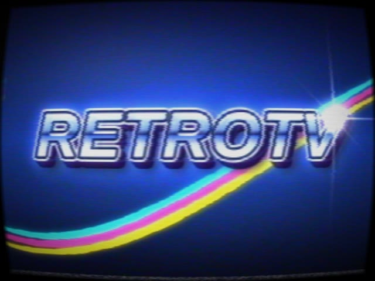
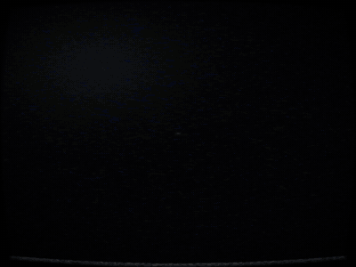
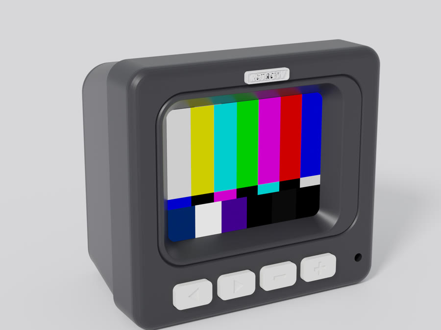
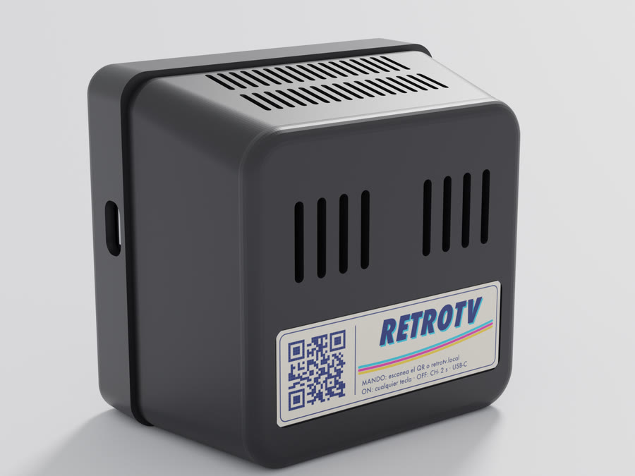
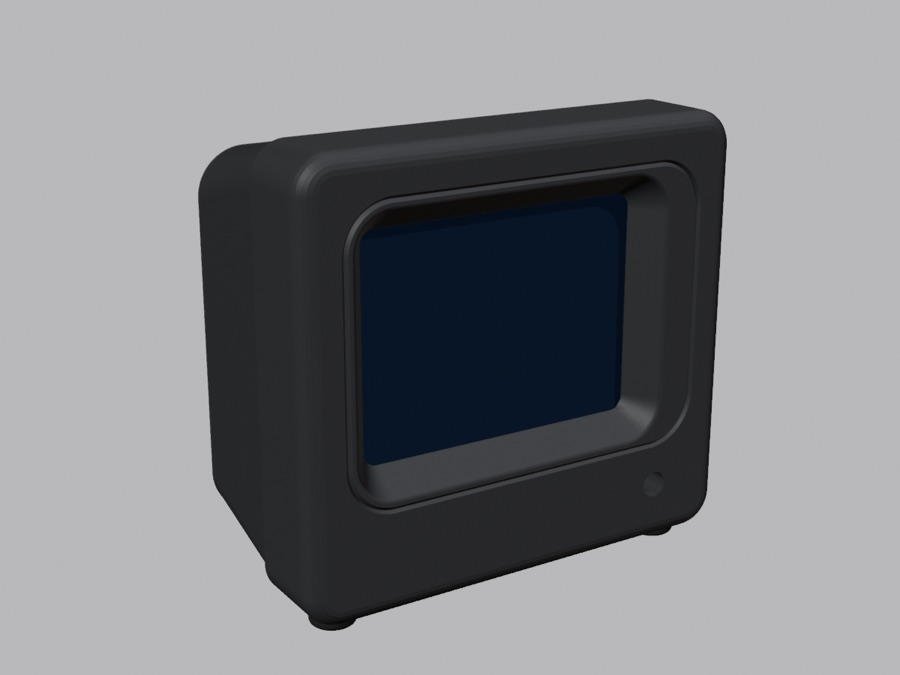
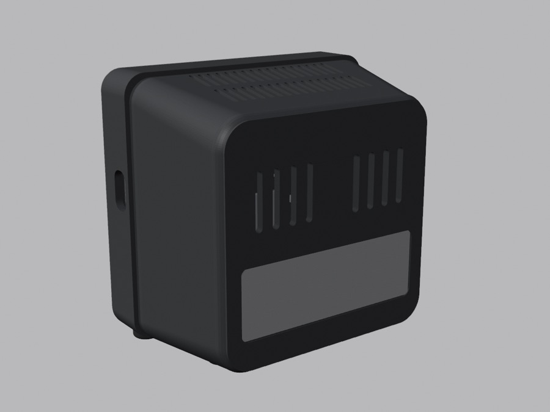
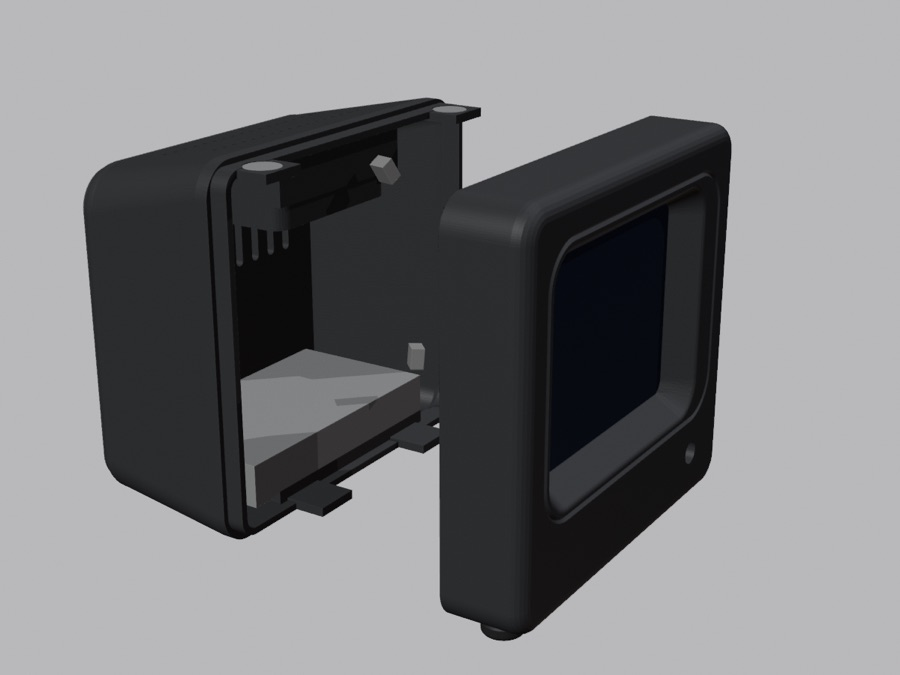
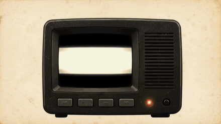
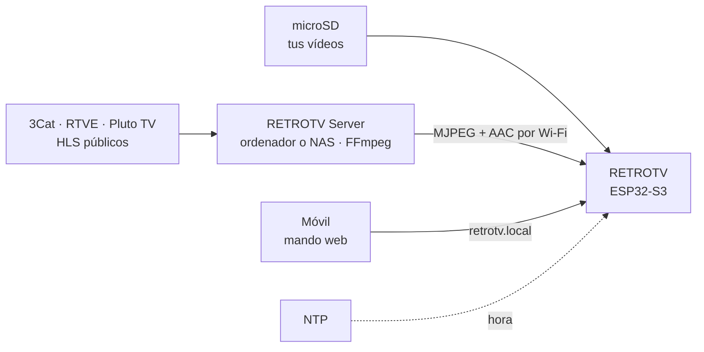
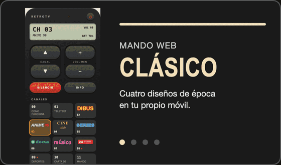

<p align="center">
  
</p>

<h1 align="center">RETROTV</h1>

<p align="center">
  <strong>Una tele de tubo de los 90, en pequeño.</strong><br>
  Enciende, sintoniza y entra en un canal que ya estaba emitiendo.
</p>

<p align="center">
  
  
  
  <a href="https://github.com/ipaud/RetroTV/actions/workflows/ci.yml"></a>
</p>

RETROTV es el firmware de una tele en miniatura hecha con una placa ESP32-S3 con pantalla de 2,8″. Cada canal es una
programación en bucle que sigue la hora real: al sintonizar entras a mitad de capítulo, con la estática y el destello
de una tele de los 90. Los vídeos salen de una microSD, y por Wi-Fi llegan el mando del móvil, la guía y los canales
de un servidor en casa.

<p align="center">
  
  <br><sub>El encendido del firmware, fotograma a fotograma.</sub>
</p>

<p align="center">
  <a href="#empieza-aquí">Empieza aquí</a> ·
  <a href="#variantes-qué-montar-y-qué-firmware">Variantes</a> ·
  <a href="#qué-hace">Qué hace</a> ·
  <a href="#documentación">Documentación</a> ·
  <a href="#estado-y-limitaciones">Estado</a> ·
  <a href="#créditos-y-licencias">Créditos</a>
</p>

> [!NOTE]
> El repositorio no contiene series ni películas. Cada usuario convierte sus propios vídeos y los copia a la
> microSD. Las imágenes de esta página son material del proyecto: renders de la carcasa, la intro, escenas del vídeo
> del canal 0, capturas del mando con canales y logos inventados, y páginas de teletexto dibujadas con el código del
> firmware.

## Empieza aquí

### Qué necesitas

- **Placa:** [Freenove ESP32-S3 Display 2.8″](https://github.com/Freenove/Freenove_ESP32_S3_Display), FNK0104A (sin
  táctil) o FNK0104B (con táctil). Pines comprobados en [la guía de hardware](docs/HARDWARE.md).
- **microSD** en FAT32 con esquema MBR. Las de más de 32 GB vienen en exFAT, que el firmware no lee: hay que
  formatearlas.
- **Cable USB-C de datos.** La placa usa el USB nativo del ESP32-S3; no hace falta ningún driver.
- **Altavoz** para el conector de la placa (JST de 1,25 mm, 2 pines). El proyecto usa uno de 40 × 28 mm.
- **Un ordenador** con [Git](https://git-scm.com/), [PlatformIO Core](https://platformio.org/) 6.x (el comando
  `pio`), `ffmpeg` y `python3`. Los ejemplos usan rutas de macOS; en Linux, cambia `/Volumes/RETROTV` por el punto de
  montaje de tu tarjeta.
- **Opcional:** una LiPo de una celda con JST 1,25 (antes de conectarla, lee
  [la comprobación de polaridad](docs/HARDWARE.md#batería)), y los pulsadores y el LED de la carcasa
  ([cableado](docs/HARDWARE.md#integración-física-en-la-carcasa)). Para montar una carcasa completa:
  [lista de materiales y orden de montaje](docs/HARDWARE.md#montaje).

### Primera prueba: el clip de demostración

Sin carcasa ni batería: solo la placa, el altavoz y la microSD. El clip de prueba lo genera
[`tools/make_demo_clip.sh`](tools/make_demo_clip.sh) con `ffmpeg`, así que no hace falta ningún vídeo.

1. Descarga el código:

   ```sh
   git clone https://github.com/ipaud/RetroTV.git
   cd RetroTV
   ```

2. Formatea la microSD en **FAT32 con esquema MBR** y llámala `RETROTV`. En macOS: Utilidad de Discos → Borrar →
   formato «MS-DOS (FAT)» y esquema «Registro de arranque principal».

3. Crea el clip de demostración en la tarjeta:

   ```sh
   tools/make_demo_clip.sh /Volumes/RETROTV
   ```

   Escribe `retrotv/media/demo/demo.mjpeg`, `demo.aac` y su índice `demo.idx` (30 s; un segundo argumento cambia la
   duración). Es la carta `testsrc` de `ffmpeg` con un contador: cada segundo, un destello blanco y un pitido.
   Necesita `ffmpeg`; `python3` crea el índice.

4. Expulsa la tarjeta y métela en la placa.

5. Conecta la placa por USB-C y graba el firmware. La primera vez, PlatformIO descarga la plataforma y tarda un rato:

   ```sh
   pio run -e pautv -t upload
   ```

   `pautv` sirve para la placa suelta. Para tu montaje, mira [la tabla de variantes](#variantes-qué-montar-y-qué-firmware).

6. Mira el registro de la tele (abrir el puerto reinicia la placa):

   ```sh
   pio device monitor
   ```

7. **Qué deberías ver:** al arrancar, la tele crea `/retrotv/config/channels.json` con los canales de ejemplo y
   sintoniza el canal 1, **RETROTV DEMO**. Si el destello y el pitido coinciden, el audio y el vídeo van sincronizados.
   Con la placa suelta, un clic en **BOOT** pasa al canal siguiente y un doble clic vuelve al anterior. Los canales 2 y
   3 están vacíos hasta que conviertas vídeos (salen como NO SIGNAL y la tele pasa al siguiente), el 8 es el teletexto
   y el 9 la carta de ajuste.

Si la subida falla porque no aparece el puerto: mantén BOOT, pulsa RESET, suelta BOOT y vuelve a lanzarla. Si dice
`No serial data received`, basta con repetirla.

### Después: tus vídeos, tus canales y la Wi-Fi

1. **Convierte tus vídeos** (solo los que tengas derecho a usar) a la carpeta del canal 2, «CANAL 1»:

   ```sh
   tools/convert_video.sh ~/Videos/MiSerie /retrotv/media/channel01 /Volumes/RETROTV
   ```

   Formatos, opciones (pista de audio, calidad, recorte 4:3) y tiempos: [convertir capítulos](docs/CHANNELS.md#convertir-capítulos).
2. **Ordena los canales** editando `/retrotv/config/channels.json`: nombres, números, carpetas, teletexto, carta de
   ajuste y canal del mando. Referencia completa: [canales](docs/CHANNELS.md#canales-retrotvconfigchannelsjson).
   Ejemplo: [data/example-config/channels.json](data/example-config/channels.json).
3. **Añade la Wi-Fi** (solo 2,4 GHz) en `/retrotv/config/wifi.json`, a partir de
   [wifi.example.json](data/example-config/wifi.example.json). Con ella llegan la hora, el
   [mando web](docs/REMOTE.md) en `http://retrotv.local` y los canales del [servidor en casa](server/README.md). Sin
   Wi-Fi, la tele funciona igual desde la SD. Detalle: [Wi-Fi](docs/CHANNELS.md#wi-fi).

## Variantes: qué montar y qué firmware

Todas usan la misma placa. Cambian la carcasa, cómo se maneja y el entorno de PlatformIO que se graba.

| Montaje | Se maneja con | Firmware (entorno) | Cómo se graba |
|---|---|---|---|
| **Placa suelta**, para probar | BOOT, mando web, puerto serie | `pautv` | `pio run -e pautv -t upload` |
| **tele90 v9**, con cuatro teclas y LED de 3 mm | Teclas, mando web | `pautv`; o `voice` para usar el micrófono | `pio run -e voice -t upload` |
| **tele90 v10 sin botones**, solo con el LED de 5 mm | Mando web y palmadas | `voice_nokeys` (obligatorio sin teclas: al apagarla nunca queda en un reposo del que solo despierta una tecla) | `pio run -e voice_nokeys -t upload` |
| **Voz:** palmadas, STANDBY VOZ, grabadora de mensajes | Tres palmadas, AJUSTES → VOZ | `voice` con teclas, `voice_nokeys` sin ellas | Como arriba ([RETROTV Voice](docs/VOICE.md)) |
| **«Hola ESP» y «Hey Retro»** (experimental): encender hablando desde STANDBY VOZ | La voz, con la tele apagada | `voice_ww` con teclas, `voice_nokeys_ww` sin ellas, **más** la app de standby de `standby/` | `pio run -e voice_nokeys_ww -t upload` y después `tools/standby_flash.sh` |

- **Cableado** de teclas y LED: [la guía de hardware](docs/HARDWARE.md#integración-física-en-la-carcasa). Las teclas
  van entre su GPIO y GND, y el LED, con una resistencia de ~1 kΩ, al TXD del conector UART (GPIO43).
- **«Hey Retro»:** su modelo **no se distribuye** en el repositorio porque se entrenó con datos de uso no comercial.
  Sin él, la app de standby compila igual y solo escucha «Hola ESP» y las palmadas. Cómo entrenar el tuyo, cómo se
  graba la app y lo medido: [la guía del wake word](docs/WAKEWORD.md). `tools/standby_flash.sh` está escrito para
  macOS.
- **Compilar y grabar cada entorno**, con sus opciones: [desarrollo](docs/DEVELOPMENT.md#compilar-y-flashear-cada-variante).

<p align="center">
  
  
  <br><sub>tele90 v9: tres piezas y cuatro teclas.</sub>
</p>

<p align="center">
  
  
  
  <br><sub>tele90 v10 sin botones: frontal y cuerpo, que cierran con 8 imanes, y solo el LED en el frontal.</sub>
</p>

**La carcasa es un diseño propio y sus archivos (STL) no están publicados**, ni los de la v9 ni los de la v10. Una
v10 con teclas vendrá más adelante. Medidas y piezas: [la guía de hardware](docs/HARDWARE.md#integración-física-en-la-carcasa).

## Qué hace

- 📺 **Canales en emisión.** Cada canal es una programación en bucle anclada a la hora real: al sintonizar entras en
  el capítulo y el segundo que tocan, y si vuelves luego, ha seguido avanzando.
- 🎞️ **Vídeo fluido.** MJPEG de 320 × 240 a 20 fps con sonido AAC sincronizado, leído por delante de la SD.
- ⚡ **Zapeo de verdad.** Estática con siseo y destello de tubo entre canales, OSD con número y nombre, carta de
  ajuste, NO SIGNAL y un apagado que recoge la imagen en una línea.
- 📟 **Teletexto con la guía real.** Qué echa ahora cada canal, cuánto le queda y qué viene después.
- 📱 **Mando web.** `http://retrotv.local` en el móvil: canales, volumen, lista con logos, guía y ajustes, sin app ni
  nube. Cuatro diseños de mandos de época.
- 📡 **Canales por red.** RETROTV Server, en un ordenador o un NAS de casa, convierte archivos y directos públicos
  (3Cat, RTVE, Pluto TV) al formato de la tele.
- 👏 **Palmadas y mensajes** (firmware `voice`). Tres palmadas apagan y encienden; una grabadora deja mensajes de
  hasta 15 s en un canal MENSAJES. Todo dentro de la tele, sin Internet.
- 🔋 **Portátil.** LiPo dentro, avisos de batería en pantalla y en el mando, y reposo con la batería agotada.

<p align="center">
  
  <br><sub>Escenas del canal 0, el vídeo de bienvenida del proyecto (no está en el repositorio).</sub>
</p>



### Controles, en resumen

| Orden | Teclas (v9) | BOOT, placa suelta | Mando web | Voz (`voice`) |
|---|---|---|---|---|
| Canal siguiente / anterior | CH+ / CH− | Clic / doble clic | CANAL ▲ / ▼ o la lista | — |
| Volumen y silencio | VOL+ / VOL−; mantener VOL− silencia | — | VOLUMEN + / −, SILENCIO | — |
| Menú de ajustes | Mantener CH+ | Mantener | AJUSTES (los del móvil) | — |
| Apagar | Mantener CH− 2 s | — | ⏻ | Tres palmadas |
| Encender | Cualquier tecla | BOOT | ⏻, solo desde STANDBY WI-FI | Tres palmadas desde STANDBY VOZ |

Todos los detalles, los modos de apagado, la batería y el LED: [controles](docs/CONTROLS.md). El mando del móvil, con
sus diseños, la guía y el emparejamiento: [mando web](docs/REMOTE.md).

<p align="center">
  
  <br><sub>Los cuatro mandos del móvil, capturados de la página real con canales y logos inventados.</sub>
</p>

## Documentación

| Para | Guía |
|---|---|
| Montar la placa, los pines, la batería y la carcasa | [Hardware](docs/HARDWARE.md) · [lista de materiales y montaje](docs/HARDWARE.md#montaje) |
| Preparar la microSD, convertir vídeos, escribir los canales y configurar la Wi-Fi | [Canales, vídeos y microSD](docs/CHANNELS.md) |
| Manejar la tele: teclas, apagado, batería, LED, menú y palmadas | [Controles](docs/CONTROLS.md) |
| Usar el mando del móvil y su API | [Mando web](docs/REMOTE.md) |
| Montar el servidor de canales por red (también en Docker o en un NAS) | [RETROTV Server](server/README.md) · [fuentes de los canales](docs/PROVIDERS.md) |
| Entender cómo está hecho el firmware | [Arquitectura](docs/ARCHITECTURE.md) |
| Micrófono, palmadas, STANDBY VOZ y grabadora | [RETROTV Voice](docs/VOICE.md) |
| «Hola ESP» y «Hey Retro» (experimental) | [Wake word](docs/WAKEWORD.md) |
| Compilar, depurar, ejecutar los tests y saber qué comprueba la CI | [Desarrollo](docs/DEVELOPMENT.md) |
| Ver qué se ha probado en la placa y qué falta | [Plan de pruebas](docs/TEST_PLAN.md) · [medidas de red](docs/NETWORK_TUNING.md) |
| Proponer un cambio: qué comprobar y qué no subir | [Contribuir](CONTRIBUTING.md) |

## Estado y limitaciones

RETROTV es un proyecto personal en desarrollo. Se ha probado en una sola placa, una FNK0104A sin táctil; el detalle de cada prueba está en [el plan de pruebas](docs/TEST_PLAN.md).

**Probado en la placa:** vídeo local a 20 fps con audio sincronizado, canales en emisión, zapeo, mando web y
ajustes, canales por red y directos, lectura y carga de la batería, palmadas, STANDBY VOZ, grabadora y mensajes, el LED
del frontal y, en pruebas, «Hola ESP» y «Hey Retro».

**Pendiente o sin medir:**
- Las cuatro teclas montadas en la carcasa: su lógica solo está probada en el ordenador.
- El táctil: solo existe en la FNK0104B y no se ha probado en ninguna.
- Apagar con tres palmadas con la tele encendida (TV21).
- Autonomía y consumo: las cifras de batería son **estimaciones** sin medidor, salvo la carga del 81 al 99 % en unas
  2 h 45 min. El aviso del LED con la batería baja aún no se ha visto con una descarga real.
- «Hola ESP» y «Hey Retro» son experimentales: aciertos y falsos positivos medidos en una sola sala y con una sola
  voz ([resultados](docs/WAKEWORD.md#resultados)).

**Límites conocidos:**
- Solo Wi-Fi de 2,4 GHz y microSD en FAT32 (no exFAT).
- Las órdenes del mando web no llevan PIN: cualquiera en tu Wi-Fi puede cambiar de canal. Los ajustes sí piden
  emparejar el móvil, y solo uno a la vez.
- Las contraseñas Wi-Fi quedan en texto plano, en `wifi.json` de la SD o en `include/secrets.h`.
- No hay comandos de voz: las palabras de activación solo encienden la tele.
- La carcasa no está publicada.

## Créditos y licencias

| Librería | Versión | Para qué | Licencia |
|---|---|---|---|
| [moononournation/Arduino_GFX](https://github.com/moononournation/Arduino_GFX) | 1.6.0 | Driver del LCD ILI9341 por SPI y primitivas de dibujo. `draw16bitBeRGBBitmap` acepta tal cual la salida big-endian de JPEGDEC. | BSD |
| [bitbank2/JPEGDEC](https://github.com/bitbank2/JPEGDEC) | 1.8.4 | Decodifica cada fotograma MJPEG, con SIMD del ESP32-S3, en bloques que se envían a la pantalla. | Apache-2.0 |
| [pschatzmann/arduino-libhelix](https://github.com/pschatzmann/arduino-libhelix) | v0.8.1 | Decodificador AAC de Helix en enteros de 16 bits. Solo se usa su API pública de bajo nivel `aacdec.h`, para no reservar memoria al cambiar de canal. | GPL-3.0 (wrapper) · RPSL/RCSL (Helix) |
| [bblanchon/ArduinoJson](https://arduinojson.org/) | 7.4.3 | Lee `channels.json` y `wifi.json`. También compila en el ordenador para los tests. | MIT |
| Driver ES8311 de Espressif (`lib/es8311/`) | del sketch 07.1 de Freenove, sin modificar | Configura el códec de audio ES8311 por I2C: reloj, formato y volumen. | Apache-2.0 (cabecera SPDX) |
| Del core: `SD_MMC`, `WiFi`, `Preferences`, `Wire`, `driver/i2s.h` | core 2.0.17 | microSD en 4 bits, Wi-Fi y NTP, ajustes en NVS, bus I2C y salida de audio I2S (driver legacy). | LGPL-2.1 / Apache-2.0 |
| [espressif/esp-sr](https://github.com/espressif/esp-sr) (app de standby) | 2.5.5 | WakeNet y el modelo «Hola ESP». | Espressif MIT (solo en chips de Espressif) |
| [espressif/esp-tflite-micro](https://github.com/espressif/esp-tflite-micro), [esp-nn](https://github.com/espressif/esp-nn) (app de standby) | 1.3.3 · 1.1.2 | TFLite Micro y sus núcleos optimizados, para «Hey Retro». | Apache-2.0 |
| [esphome/esp-micro-speech-features](https://github.com/esphome/esp-micro-speech-features) (app de standby) | 1.2.3 | Preprocesador de audio de microWakeWord (40 características cada 10 ms). | Apache-2.0 |
| `standby/src/MicroWakeWord.*`, adaptado de [`micro_wake_word` de ESPHome](https://github.com/esphome/esphome/tree/dev/esphome/components/micro_wake_word) | — | Motor de «Hey Retro»: modelo en streaming y detección. | GPL-3.0 (ESPHome License) |
| `standby/models/hey_jarvis.tflite`, de [esphome/micro-wake-word-models](https://github.com/esphome/micro-wake-word-models) | v2 | Modelo de prueba del motor. El de «Hey Retro» no está en el repo. | Apache-2.0 |

- **arduino-libhelix es GPL-3.0.** Si en el futuro se distribuye el binario del firmware a terceros, habrá que revisar
  las obligaciones de GPL o sustituir el decodificador AAC. Para uso personal no hay ningún problema.
- **`standby/src/MicroWakeWord.*` es GPL-3.0** (adaptado de ESPHome; texto en [LICENSES/GPL-3.0.txt](LICENSES/GPL-3.0.txt)),
  y con él la app de standby compilada; lo mismo que con arduino-libhelix.
- **Código de RETROTV:** licencia MIT ([LICENSE](LICENSE)), salvo los archivos marcados con otra licencia.
- **Carcasa:** tele90 v9 y v10, diseño propio; sus archivos no están en este repositorio.
- **Contenido:** series, películas, logos de canales y directos son de sus dueños y no forman parte del proyecto.
  El repo no incluye ni enlaza vídeos: cada uno pone en la SD los suyos o los que tenga derecho a usar.
