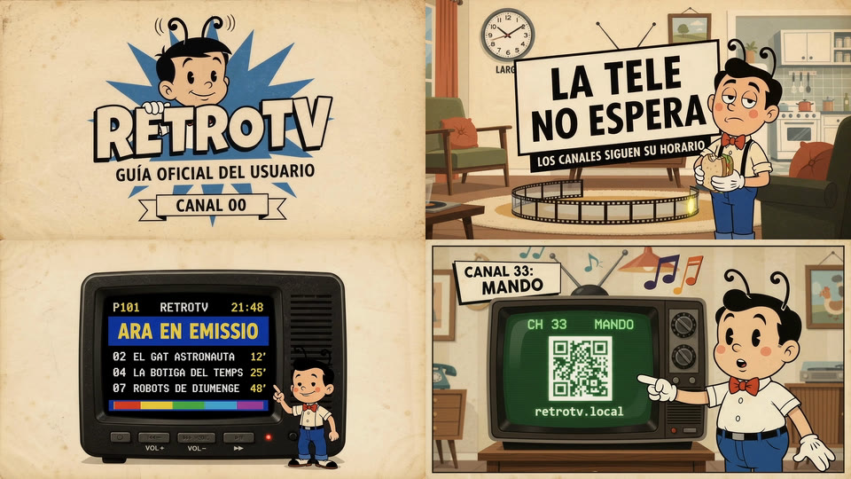
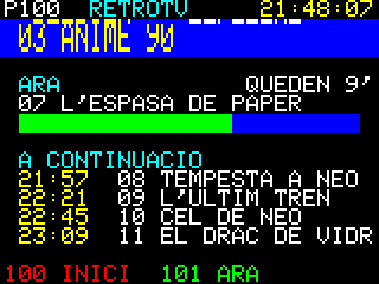

# Canales, vídeos y microSD

Cómo se organiza la microSD, cómo se escriben los canales, cómo se convierten los vídeos y cómo se
configura la Wi-Fi. Volver al [README](../README.md).

## microSD

- **Formato:** FAT32 con esquema MBR. El core 2.0.17 **no lee exFAT**, que es como vienen de fábrica las tarjetas
  de más de 32 GB. Comprueba las tarjetas nuevas con `f3write`/`f3read`: una de 32 GB, probablemente falsa, perdió su
  sistema de archivos.
- **Cómo se monta:** en 4 bits a 40 MHz y, si falla, a 20 MHz. El firmware nunca formatea la tarjeta. Si deja de
  responder (pasa a veces mientras la Wi-Fi busca redes), la tele la vuelve a montar sola y sigue.
- **Espacio:** ~370 MB por capítulo de 23 min: en 64 GB caben unos 160.
- **Estructura:** se crea al arrancar si falta:

```
/retrotv/config/channels.json   canales
/retrotv/config/wifi.json       Wi-Fi (opcional)
/retrotv/media/channel01/       capítulos de una serie (.mjpeg + .aac + .idx con el mismo nombre)
/retrotv/media/channel02/
/retrotv/media/demo/            clip de demostración
/retrotv/logos/<id>.png         logos de los canales para el mando web (opcional), más <id>.black.png y <id>.white.png
/retrotv/system/intro.mjpeg (+ .aac) vídeo al encender, opcional (convert_video.sh <carpeta> /retrotv/system;
                    con RECORTE_4_3=1 si es 4:3 dentro de 16:9). Tras él, la transición de canal
/retrotv/sounds/                    reservada para versiones futuras
```

Los archivos ocultos que crea macOS (`._*`, `.Spotlight-V100`…) se ignoran.

## Convertir capítulos

Requiere `ffmpeg` y la SD montada en el ordenador.

```sh
tools/convert_video.sh ~/Videos/MiSerie /retrotv/media/channel01 /Volumes/RETROTV
PISTA=1 tools/convert_video.sh ...        # 2.ª pista de audio (doblajes); por defecto la 0
CALIDAD=5 FPS=20 tools/convert_video.sh ...  # calidad JPEG (2 mejor – 31) y fps (1–24); por defecto 3 y 20
RECORTE_4_3=1 tools/convert_video.sh ...  # imagen 4:3 dentro de un 16:9: llena la pantalla sin bandas
SOLO_VIDEO=1 tools/convert_video.sh ...   # rehace solo la imagen de lo ya convertido; conserva el .aac
FILTROS="deblock=filter=strong:block=8,hqdn3d=2:1.5:3:3,eq=gamma=1.12:saturation=1.15" tools/convert_video.sh ...
                                          # filtros de ffmpeg antes de reducir, por serie: este quita bloques
                                          # y ruido de una fuente MPEG-4 y la aclara un poco (Evangelion)
tools/make_demo_clip.sh /Volumes/RETROTV  # clip de demo original: destello + pitido cada segundo (sincronía)
```

| | Formato |
|---|---|
| Entradas | mp4, mkv, avi, mov, m4v, webm (también enlaces simbólicos) |
| Vídeo | `<nombre>.mjpeg`: MJPEG crudo, 320×240, 20 fps (`FPS`), yuvj420p, `-q:v 3` (`CALIDAD`). 4:3 llena la pantalla; 16:9 queda 320×176 con bandas negras (cortada a bloques JPEG enteros de 16 píxeles, para que el ruido del JPEG no manche las bandas); los anamórficos se corrigen. Nunca se deforma |
| Audio | `<nombre>.aac`: AAC-LC en ADTS, mono, 44.1 kHz, 32 kb/s, loudnorm a −16 LUFS (pico −1.5 dBTP) para el altavoz pequeño |
| Índice | `<nombre>.idx`: segundos y fps, para entrar en emisión ([En emisión](#en-emisión)) |
| Nombres | ASCII sin acentos, en minúsculas, seguros en FAT |
| Tamaño | ~370 MB por capítulo de 23 min (q3 a 20 fps: 13 KB por fotograma de media) |
| Velocidad | ~30 s por capítulo en un Mac con Apple Silicon |

**Por qué q3 y 20 fps** (medido en la placa, 2026-10-01): a 24 fps dibujar un fotograma ocupa 38 de sus 41,7 ms y se
pierden fotogramas. A 20 fps, q3, q4 y q5 van igual de fluidos y q3 se ve mejor: +3 dB de PSNR frente a q5 por un
tercio más de espacio.

- Lo ya convertido se salta.
- Todo se escribe como `.part` y se renombra al final: un corte no deja capítulos rotos.
- Primero se convierte el audio, así que una `PISTA` que no existe falla al momento.
- Al terminar, `dot_clean -m /Volumes/RETROTV` borra los `._*` de macOS. El firmware los ignora igualmente.

## Canales (`/retrotv/config/channels.json`)

```json
{ "channels": [
  { "id": "bola", "number": 2, "name": "Bola de Drac", "type": "local",
    "source": "/retrotv/media/channel01", "enabled": true },
  { "id": "carta", "number": 9, "name": "Carta de ajuste", "type": "internal",
    "source": "testcard" }
] }
```

| Campo | Obligatorio | Notas |
|---|---|---|
| `id` | sí | texto, hasta 23 caracteres |
| `number` | sí | 0–999, sin repetir; el zapeo sigue este orden y se salta los huecos (el 0 va antes del 1: sirve para un tutorial) |
| `name` | sí | se muestra en el OSD en mayúsculas y sin acentos (la fuente de 8 bits no los tiene: "Bola de Drac" → `BOLA DE DRAC`) |
| `type` | sí | `local`, `internal`, `remote` (por red, desde RETROTV Server); `hls-proxy`, `tunarr` y `stream` se reconocen pero muestran NO SIGNAL "V0.2" |
| `source` | sí | `local`: un `.mjpeg` o una **carpeta**: con índices, sus capítulos en orden de nombre y **en emisión**; sin ellos, un capítulo al azar desde el principio. `internal`: `testcard` (carta de ajuste), `teletext` o `mando` (un QR para abrir el mando web). `remote`: `http://<servidor>:8080/channel/<n>` |
| `enabled` | no | `true` por defecto; los desactivados se saltan al hacer zapeo |

- **Entradas inválidas:** se ignoran y el log dice cuál y por qué (`[CHANNEL] 2 entries skipped, first: #3: unknown type`).
- **Sin ningún canal válido, o sin SD:** error en pantalla durante 5 s y la tele sigue con la carta de ajuste.
- **Si un canal falla** (carpeta vacía, archivo roto): NO SIGNAL durante 3 s y pasa solo al siguiente.
- **Memoria:** el último canal y el volumen se recuerdan tras apagar.

**Un canal 0 de bienvenida.** El 0 va antes del 1, así que sirve para un vídeo que explique la tele, en bucle como
cualquier otro canal. El de este proyecto es propio y no viene en el repositorio:

<p align="center">
  
</p>

## En emisión

Cada canal local es una programación en bucle: sus capítulos **en orden de emisión**, uno detrás de otro.
- El orden es el del nombre, pero **natural**: los separadores no cuentan y los números se comparan como números.
- Así, aunque una serie mezcle estilos (`Harlock -01- …` y `Harlock_02_…`, o `Hattori -008-` y `Hattori_010_…`),
  cada capítulo sale en su sitio.

- **Al sintonizar**, la tele calcula dónde va la emisión: `hora UTC mod duración total`. Entra en ese capítulo y en
  ese segundo, igual que una tele de verdad. Si vuelves al canal un rato después, ha seguido avanzando.
- **Al acabar un capítulo** empieza el siguiente desde el principio.
- **Sin hora** (sin Wi-Fi, o antes de que llegue el NTP) usa un reloj de sesión: un origen al azar en cada arranque
  más el tiempo encendida. Los canales siguen siendo continuos mientras la tele está encendida.

Para saltar a un segundo concreto hace falta un `<nombre>.idx` junto a cada capítulo:
- **Qué contiene:** dónde empieza cada segundo en el `.mjpeg` y en el `.aac`, y los fps del capítulo (sin `.idx` se
  reproduce a 24). Unos 11 KB por capítulo de 23 min.
- **Cómo se genera:** `convert_video.sh` lo hace solo al convertir. Para lo convertido antes, o si falta:

```sh
tools/make_index.py /Volumes/RETROTV/retrotv/media   # recorre la SD; solo (re)indexa lo que falta o ha cambiado;
                                                    # sin --fps conserva los del .idx que había (si no, 24)
```

- **Si falta algún índice en un canal,** ese canal funciona como antes (capítulo al azar desde el principio) y el log
  dice cuál falta.
- **Si un índice no coincide** con su capítulo (reconvertido sin reindexar), la tele lo detecta y empieza desde el
  principio.

## Teletexto

Un canal `internal` con `"source": "teletext"` es un teletexto con la **guía de programación real**. Como cada canal
emite según la hora y las duraciones de sus `.idx`, la tele sabe qué echa cada uno ahora y qué viene después. Los
canales en directo salen de la guía del servidor.

| Página | Qué muestra |
|---|---|
| **P100** Inici | Portada: fecha, índice y cómo pasar de página |
| **P101** Ara en emissió | Todos los canales: el capítulo de ahora y los minutos que le quedan (5 por subpágina: 1/3, 2/3…) |
| **P2NN** | La guía del canal NN (P203 = canal 3): el capítulo de ahora con una barra de progreso y los 4 siguientes con su hora |

<p align="center">
  
  <br><sub>P100 → P101 → P202 → P203, con canales inventados. Dibujado con la fuente, los colores y el repintado de arriba
  abajo del firmware (<code>Teletext.h</code> y <code>UITeletext.cpp</code>), a 320×240 y ampliado al doble.</sub>
</p>

- **Pasar de página:** solas cada 12 s, en orden. VOLUMEN +/− (o un toque) pasa a mano; la página elegida se queda 60 s.
- **Estilo:** rejilla de 26×15 caracteres con los 8 colores del teletexto y títulos a doble altura. Es mudo.
- **Títulos:** salen del nombre del archivo. El primer número es el capítulo y las palabras siguientes el título, hasta
  la primera etiqueta de ripeo (`per`, `by`, `dvdrip`…). Lista en `src/teletext/Teletext.h` (`isRipTag`); los
  nombres propios de tu colección (quién lo subió, de qué web) van en `include/title_tags.h`, que no se sube al repo.
- **Sin hora** (sin Wi-Fi): las horas de inicio salen como minutos desde ahora (`+12'`).
- **Al entrar**, lee la cabecera `.idx` de los canales que aún no se habían sintonizado, uno por vuelta del bucle.
  Mientras tanto, esos canales dicen `CERCANT...`.

## Canales por red (RETROTV Server)

Un canal `remote` llega por Wi-Fi desde **RETROTV Server**, un servidor en el ordenador de casa o en un NAS
(`server/`, Python + FastAPI, también en Docker). La tele no sabe qué hay detrás: para ella es una URL, y el servidor le
da vídeo y audio en su formato, que reproduce el mismo `MediaPlayer` que lee de la SD.
- **Qué emite el servidor:** archivos ya convertidos y **directos**: un HLS público cualquiera, canales de **3Cat**
  desde su API oficial, el Canal 24 Horas de **RTVE** (lo que RTVE da sin DRM ni registro) y canales de **Pluto TV**.
- **Cómo:** FFmpeg transcodifica en el ordenador. La tele nunca ve HLS.
- **Fuentes, límites y decisiones** (por ejemplo, el cifrado de Pluto TV): [fuentes de los canales por red](PROVIDERS.md).
  Instrucciones del servidor, también para QNAP: [RETROTV Server](../server/README.md).

```sh
server/run.sh --lan    # en el ordenador: 0.0.0.0:8080, anuncia retrotv-server.local, canal 1 = REMOTE DEMO
```

En `channels.json` de la SD:

```json
{ "id": "remote_demo", "number": 20, "name": "Remote Demo", "type": "remote",
  "source": "http://retrotv-server.local:8080/channel/1", "enabled": true },
{ "id": "sx3", "number": 21, "name": "SX3", "type": "remote",
  "source": "http://retrotv-server.local:8080/channel/10", "enabled": true }
```

El número tras `/channel/` es el del canal **en el servidor** (`server/config/channels.json`): en el ejemplo, 1 es
el demo, 2 HLS TEST y 10 SX3. El número de la tele (`number`) lo eliges tú.

- **Al sintonizar**, la tele pide una sesión al servidor. El servidor fija el instante del canal (también **en
  emisión**) y la tele abre vídeo y audio desde ese mismo instante.
- **Mientras conecta** sigue la estática con su siseo. En cuanto tiene ~1,3 s de vídeo en el búfer, destello y
  empieza la imagen: en un archivo 1–2 s y en un directo 2–8 s, porque primero arranca FFmpeg.
- **Si algo falla**, NO SIGNAL con el motivo:

  | Motivo | Qué pasa |
  |---|---|
  | `OFFLINE` | La tele no tiene Wi-Fi. Los canales de la SD siguen igual |
  | `NO SERVER` | El servidor no responde o `retrotv-server.local` no resuelve (pon la IP) |
  | `NO CHANNEL` | Ese número no existe en el servidor |
  | `CHANNEL OFF` | Existe, pero el servidor no lo puede emitir ahora |
  | `SIGNAL LOST` | Se cortó a mitad: el servidor se paró o la red dejó de llegar 3 s |

  - **Reintentos:** la tele vuelve a probar a los 2, 4 y 8 s, y después cada 15 s mientras sigas en el canal. Cuando
    el servidor vuelve, la imagen vuelve sola.
  - **Nunca se queda bloqueada:** puedes cambiar de canal en cualquier momento.
- **macOS:** la primera vez, el firewall pregunta si Python puede aceptar conexiones entrantes. Hay que decir que sí;
  si no, la tele muestra `NO SERVER`.
- **Volver a modo local:** basta con cambiar de canal. Sin servidor ni Wi-Fi, los canales de la SD funcionan como
  siempre.

## Wi-Fi

La tele funciona siempre desde la SD. El Wi-Fi aporta la hora (NTP), los canales remotos y el mando web. El ESP32-S3
solo usa **2.4 GHz**.

- **Primer intento:** dura como mucho 8 s, en paralelo con las pantallas de arranque. Si no conecta, la tele entra
  en LOCAL MODE al momento y reintenta en segundo plano cada 60 s.
- **Varias redes:** la tele recuerda hasta 8 y se une sola a la que tenga a su alcance (casa, oficina…).
  - **Cómo elige:** con más de una red, cada intento empieza con un escaneo en segundo plano (~2 s). Prueba primero
    las redes conocidas que ve, de la más fuerte a la más débil. Después prueba las que no ve, por si alguna tiene
    el SSID oculto.
  - **Si no encuentra ninguna:** el log lista las redes de 2.4 GHz que sí ve (`[WIFI]   visible: …`). Sirve para
    saber si la oficina emite en 2.4 GHz y con qué nombre.
- **Dónde se guardan:** se juntan las dos fuentes; si un SSID se repite, gana `wifi.json`.
  1. `/retrotv/config/wifi.json` en la SD: `{"networks": [{"ssid": "...", "password": "..."}, ...]}`. Una sola red
     también vale en el formato de antes, `{"ssid": "...", "password": "..."}`. Ejemplo en
     [wifi.example.json](../data/example-config/wifi.example.json). También se añaden desde los ajustes del mando web.
  2. `include/secrets.h` para desarrollo: se copia de `include/secrets.example.h` y git lo ignora. Admite una red
     (`PAUTV_WIFI_SSID` / `PAUTV_WIFI_PASSWORD`) y más con `PAUTV_WIFI_NETWORKS`.

> [!WARNING]
> La contraseña queda en **texto plano** en ambos casos: en la SD, legible por cualquiera que la meta en un
> ordenador, y dentro del firmware si se usa `secrets.h`. Usa una red de invitados si eso te preocupa.

**Ajustes guardados:** el volumen, el último canal y el brillo se guardan en NVS (flash interna) cuando llevan 4 s sin
cambiar, para no desgastar la flash con el zapeo. Al reiniciar se recuperan.
